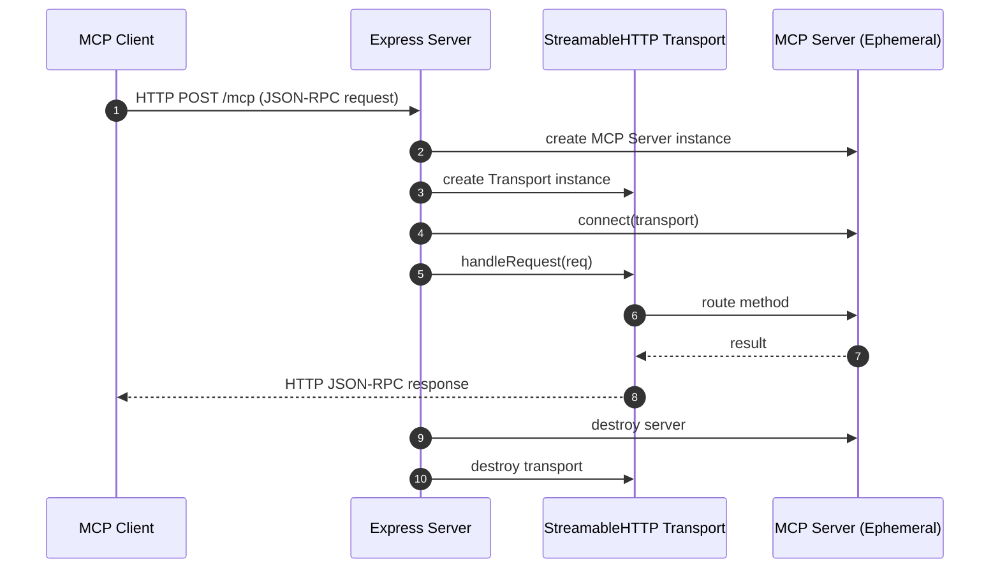
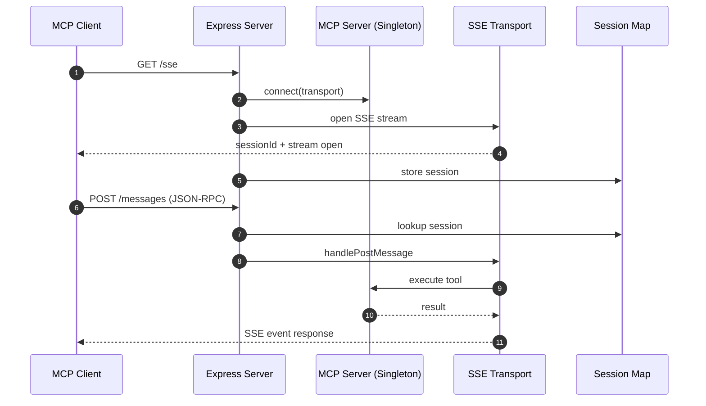

# Comprehensive Walkthrough of the Model Context Protocol (MCP) HTTP Implementation

This walkthrough explains a **stateless HTTP architecture for MCP** using the `StreamableHTTP` transport.

In this design, the server does not maintain persistent connections. Instead, it:

* Instantiates a fresh server and transport for each incoming request
* Processes a single JSON-RPC payload
* Streams the response back over HTTP
* Tears down all per-request resources immediately after completion

This pattern closely resembles a **serverless execution model layered on top of Express**.

---

# Architecture Overview

Before diving into the code, it is important to understand how `StreamableHTTP` behaves in MCP.

## Key Execution Model

### 1. Client Perspective (Stateful Illusion)

The client behaves as though it maintains a continuous session. It sends standard HTTP POST requests containing JSON-RPC 2.0 messages.

```
Client Mental Model
┌──────────────────────────────┐
│ MCP Session (illusion)       │
│  ping / tools / prompts      │
│  looks persistent            │
└────────────┬─────────────────┘
             │ HTTP POSTs
             ▼
```

---

### 2. Server Perspective (Stateless Execution)

Each request triggers a completely isolated execution cycle:

* A new MCP server instance is created
* A new transport is instantiated
* The request is processed
* The response is streamed back
* All resources are destroyed immediately afterward

```
Server Reality (Per Request)
┌──────────────────────────────────────┐
│ HTTP POST arrives                    │
│  ┌──────────────────────────────┐   │
│  │ create McpServer             │   │
│  │ create Transport             │   │
│  │ execute JSON-RPC             │   │
│  │ return response              │   │
│  │ destroy everything           │   │
│  └──────────────────────────────┘   │
└──────────────────────────────────────┘
```

This produces a **stateless, request-scoped execution model with stateful semantics at the protocol layer**.

---

# 1. Client Walkthrough (`client.ts`)

The client initializes an MCP session, connects via HTTP transport, performs a basic health check, and ensures deterministic cleanup.

---

## Step 1: SDK Imports & Endpoint Configuration

```typescript
import { Client } from "@modelcontextprotocol/sdk/client/index.js";
import { StreamableHTTPClientTransport } from "@modelcontextprotocol/sdk/client/streamableHttp.js";

const baseUrl = new URL("http://localhost:3000/mcp");
```

```
Client Layer Stack
┌──────────────────────────────┐
│ MCP Client                   │
├──────────────────────────────┤
│ StreamableHTTP Transport     │
├──────────────────────────────┤
│ HTTP POST /mcp               │
└──────────────────────────────┘
```

* **Client**: Core MCP interface for issuing protocol-level commands (tools, prompts, resources)
* **StreamableHTTPClientTransport**: Converts MCP calls into JSON-RPC HTTP requests

---

## Step 2: Client & Transport Initialization

```typescript
const client = new Client({
  name: "example-client",
  version: "1.0.0"
});

const transport = new StreamableHTTPClientTransport(baseUrl);
```

```
Handshake Setup Flow
Client
  │
  ├── identity metadata
  │
  ▼
Transport
  │
  ├── baseUrl = /mcp
  └── ready to send JSON-RPC
```

---

## Step 3: Execution Lifecycle

```typescript
try {
  await client.connect(transport); // handshake phase

  console.log("Connected to MCP server using Streamable HTTP transport");

  const pingResult = await client.ping(); // health check
  console.log("Server ping result:", pingResult);

} catch (error) {
  console.error("Error occurred:", error);

} finally {
  await client.close(); // deterministic cleanup
  console.log("Disconnected from the MCP server");
}
```

### Lifecycle Flow

```
CONNECT
  │
  ▼
Handshake (JSON-RPC initialize)
  │
  ▼
PING
  │
  ▼
Server executes stateless request
  │
  ▼
Response returned
  │
  ▼
CLOSE
  │
  ▼
Cleanup transport
```

---

# 2. Server Walkthrough (`server.ts`)

The server exposes a single HTTP endpoint and uses Express middleware to process JSON-RPC payloads.

---

## Step 1: Express Setup

```typescript
const app = express();
app.use(express.json());

app.post("/mcp", async (req: Request, res: Response) => { ... });
```

```
HTTP Layer Map
┌──────────────────────────────┐
│ Express App                  │
│                              │
│ POST /mcp                    │
│   ↓                          │
│ JSON-RPC handler            │
└──────────────────────────────┘
```

---

## Step 2: Request-Scoped MCP Instantiation

```typescript
const server = new McpServer({
  name: "example-server",
  version: "1.0.0",
  description: "Does nothing yet",
});

const transport = new StreamableHTTPServerTransport({
  sessionIdGenerator: undefined,
});
```

### Per-request lifecycle

```
Each HTTP Request
──────────────────────────────
Request arrives
   │
   ▼
┌──────────────────────┐
│ McpServer instance   │  (NEW)
├──────────────────────┤
│ Transport instance   │  (NEW)
└──────────────────────┘
   │
   ▼
Execute JSON-RPC
```

---

## Step 3: Resource Cleanup

```typescript
res.on("close", () => {
  console.log("Closing transport and server");
  transport.close();
  server.close();
});
```

```
Connection Lifecycle
┌───────────────┐
│ request open  │
└──────┬────────┘
       ▼
 execution
       ▼
 response sent
       ▼
┌──────────────────────┐
│ res.close event      │
└─────────┬────────────┘
          ▼
 destroy MCP server
 destroy transport
```

---

## Step 4: Request Execution

```typescript
try {
  await server.connect(transport);

  console.log(`MCP server ready to handle: ${req.body?.method || 'unknown method'}`);

  await transport.handleRequest(req, res, req.body);
}
```

```
Execution Pipeline
────────────────────────────
JSON-RPC Request
      │
      ▼
connect(server, transport)
      │
      ▼
route method
      │
      ▼
execute tool / ping
      │
      ▼
serialize response
      │
      ▼
HTTP stream back
```

---

## Step 5: Error Handling

```typescript
} catch (err) {
  console.error("MCP error:", err);

  if (!res.headersSent) {
    res.status(500).json({
      jsonrpc: "2.0",
      error: {
        code: -32603,
        message: "Internal server error"
      },
      id: req.body?.id || null,
    });
  }
}
```

```
Error Path
──────────
Exception occurs
      │
      ▼
check headersSent?
      │
   ┌──┴──────────┐
   ▼             ▼
send JSON-RPC   skip (already streaming)
error response
```

---

# Summary: Request Lifecycle

```
Client sends JSON-RPC
        │
        ▼
HTTP POST /mcp
        │
        ▼
create MCPServer
        │
        ▼
execute method
        │
        ▼
stream response
        │
        ▼
destroy server
```

---

# Architectural Interpretation

This design is best understood as:

> A **serverless execution model implemented inside an Express HTTP server**

## Key Characteristics

```
Isolation Level:   HIGH
State:             NONE
Lifecycle:         REQUEST-SCOPED
Reuse:             ZERO
```

## Tradeoffs

```
      +----------------------+
      | Stateless MCP        |
      +----------------------+
      | + Simple scaling     |
      | + High isolation     |
      | - Re-init overhead   |
      | - No session memory  |
      +----------------------+
```

---

# Transition to Production MCP (SSE)

Now evolving into persistent architecture:

```
STATLESS HTTP  →  STATEFUL SSE
```

---

# 3. Production Architecture (SSE-Based MCP)

## Singleton MCP Server Initialization

```typescript
const mcpServer = new McpServer({
  name: "production-mcp-server",
  version: "1.0.0",
  description: "A stateful, persistent production MCP server"
});
```

```
BOOT TIME INITIALIZATION
─────────────────────────
Node starts
   │
   ▼
create MCP SERVER (ONCE)
   │
   ▼
register tools
   │
   ▼
serve all sessions
```

---

## SSE Connection Endpoint

```typescript
app.get("/sse", async (req: Request, res: Response) => {
  const transport = new SSEServerTransport("/messages", res);

  const sessionId = transport.sessionId;
  activeTransports.set(sessionId, transport);

  await mcpServer.connect(transport);

  res.on("close", () => {
    activeTransports.delete(sessionId);
    transport.close();
  });
});
```

```
SSE SESSION FLOW
────────────────
Client → GET /sse
            │
            ▼
   open event stream
            │
            ▼
 assign sessionId
            │
            ▼
 store transport map
```

---

## Command Ingestion Endpoint

```typescript
app.post("/messages", async (req: Request, res: Response) => {
  const sessionId = req.query.sessionId as string;

  const transport = activeTransports.get(sessionId);

  if (!transport) {
    res.status(404).send("Session not found");
    return;
  }

  await transport.handlePostMessage(req, res, req.body);
});
```

```
COMMAND FLOW
────────────
POST /messages
     │
     ▼
lookup sessionId
     │
     ▼
route to transport
     │
     ▼
execute on MCP server
     │
     ▼
stream SSE response
```

---

## Client (SSE Version)

```typescript
const transport = new SSEClientTransport(new URL("http://localhost:3000/sse"));

const client = new Client({
  name: "production-client",
  version: "1.0.0"
});

await client.connect(transport);

const result = await client.callTool({
  name: "get-weather",
  arguments: {}
});

console.log(result);

await client.close();
```

```
CLIENT SSE FLOW
───────────────
connect → open stream
   │
   ▼
session established
   │
   ▼
POST tool call
   │
   ▼
receive SSE event
   │
   ▼
close session
```

---

# Stateless vs Stateful MCP

```
┌───────────────────────────┬────────────────────────────┐
│ Stateless HTTP            │ Stateful SSE               │
├───────────────────────────┼────────────────────────────┤
│ request = full lifecycle  │ request = session event    │
│ MCP recreated each time   │ MCP singleton reused       │
│ no memory                 │ session memory exists      │
│ HTTP only                │ HTTP + SSE                 │
└───────────────────────────┴────────────────────────────┘
```

---

# Final Mental Model

```
STATLESS:
Client → Request → Build Server → Execute → Destroy

STATEFUL:
Client → Open Session → Send Commands → Stream Responses
```

---

# Mermaid Sequence Diagrams

## 1. Stateless MCP over HTTP



---

## 2. Stateful MCP over SSE



