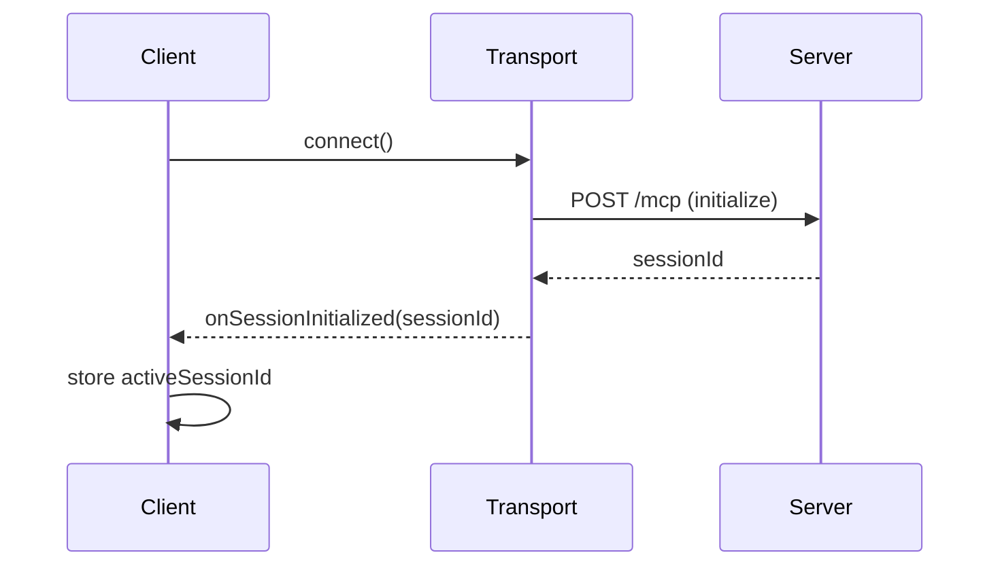
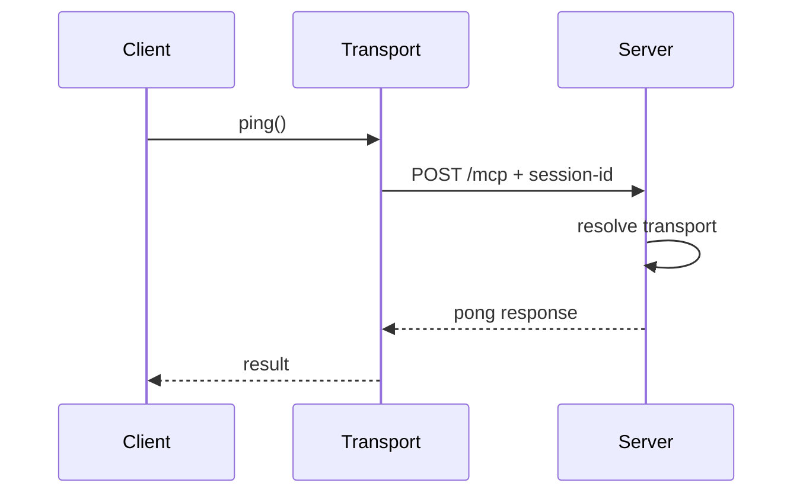
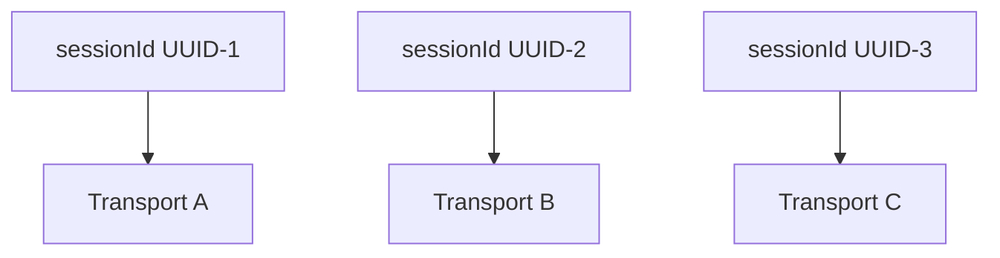
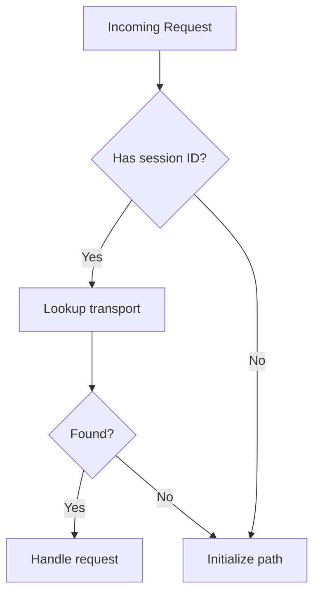
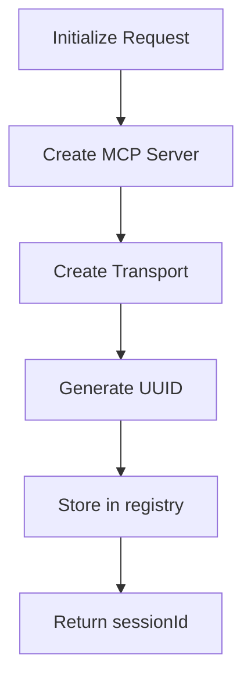
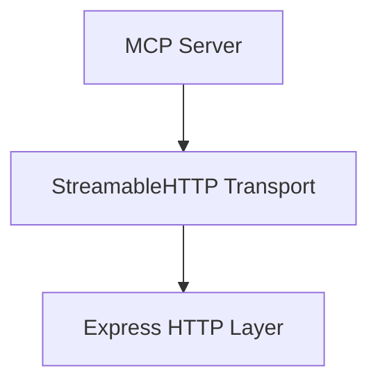
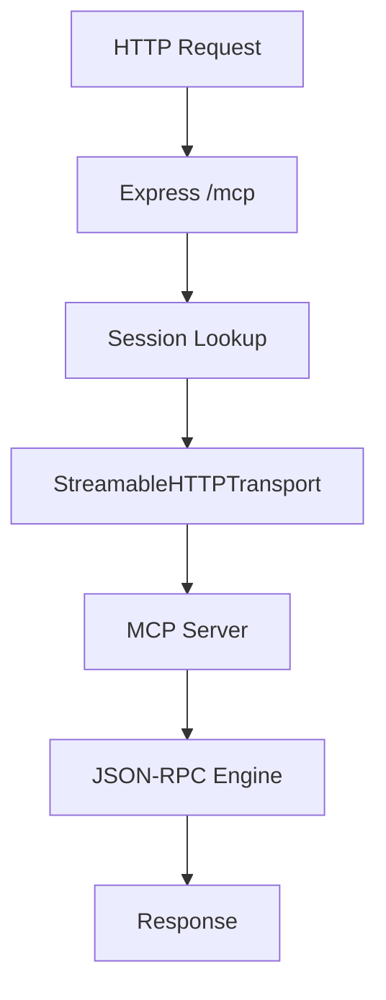
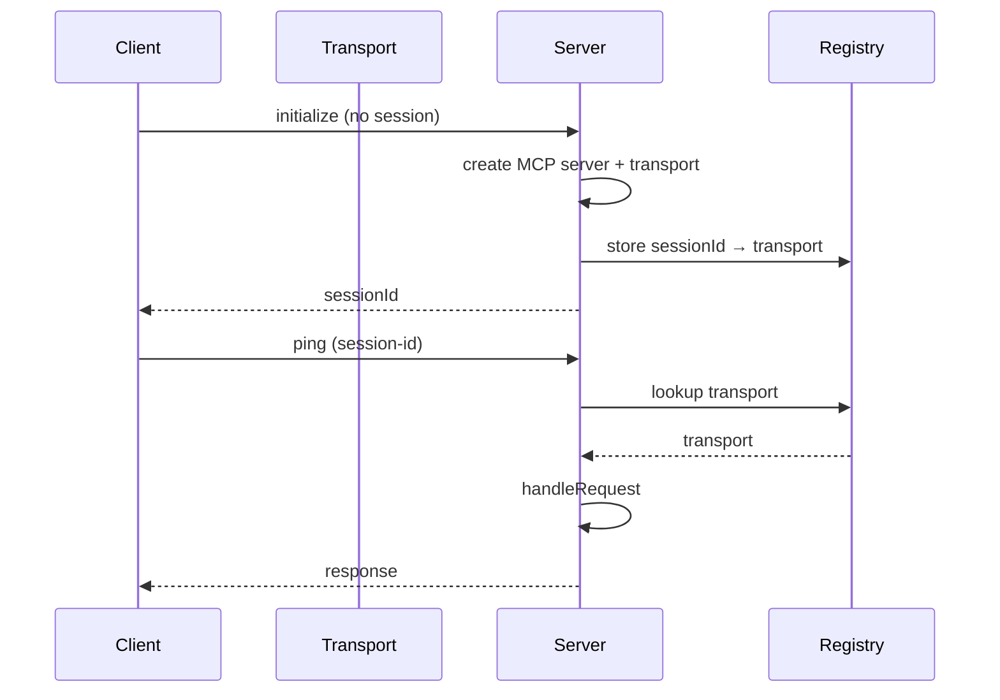
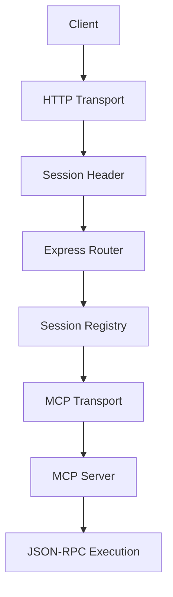

# 🧠 MCP Stateful HTTP Walkthrough (Client + Server)

This system demonstrates how MCP (Model Context Protocol) emulates **stateful sessions over stateless HTTP** using:

> A shared `mcp-session-id` that binds multiple HTTP requests to a single in-memory transport instance.

---

# 1. 🟦 CLIENT (`client.ts`) — Session-Aware MCP Client

---

## 1.1 Imports

```ts
import { Client } from "@modelcontextprotocol/sdk/client/index.js";
import { StreamableHTTPClientTransport } from "@modelcontextprotocol/sdk/client/http.js";
```

### What this means:

* `Client` → MCP protocol orchestrator (handles JSON-RPC lifecycle)
* `StreamableHTTPClientTransport` → HTTP transport layer that:

  * sends requests
  * receives responses
  * manages session headers
  * supports streaming semantics

---

## 1.2 Entry Function

```ts
async function runClient(){
```

This wraps the entire MCP lifecycle:

* connect
* initialize session
* execute RPC calls
* close connection

---

## 1.3 Server Endpoint

```ts
const serverUrl = "http://localhost:3000/mcp";
```

All MCP traffic goes through a **single HTTP endpoint**:

```
POST /mcp
```

This is intentionally simple because:

* routing is session-based, not URL-based

---

## 1.4 Session State (Client Memory)

```ts
let activeSessionId: string | null = null;
```

### What this represents:

This is the **client-side session memory**.

* Initially: `null`
* After initialization: stores server-generated UUID

---

## 🔁 Mental Model

```
Client memory
   ↓
activeSessionId = UUID
   ↓
Used to bind all future requests
```

---

## 1.5 Transport Layer (Core Mechanism)

```ts
const transport = new StreamableHTTPClientTransport({
  url: serverUrl,
```

### What this does:

This object is the **HTTP session engine**.

It handles:

* request dispatching
* response parsing
* session header injection
* initialization lifecycle hooks

---

## 1.6 Header Injection (Session Binding Mechanism)

```ts
headers: () => {
  return activeSessionId ? { "mcp-session-id": activeSessionId } : {};
}
```

### What this means:

Every request dynamically evaluates headers.

---

### 🔁 Behavior

| State       | Header Sent                |
| ----------- | -------------------------- |
| Before init | `{}`                       |
| After init  | `{ mcp-session-id: UUID }` |

---

### 🧠 Why this matters

This is what transforms HTTP into a **session-aware protocol**:

```
Stateless HTTP
      ↓
Stateful illusion via headers
```

---

## 1.7 Session Initialization Hook

```ts
onSessionInitialized: (sessionId) => {
  activeSessionId = sessionId;
}
```

### When this fires:

After successful MCP initialization:

```
initialize → server → returns sessionId
```

### What it does:

* captures server-generated UUID
* stores it locally
* enables session continuity

---

## 🔁 Flow

```text
Server → sessionId
        ↓
Client stores it
        ↓
Used in all future requests
```

---

## 1.8 MCP Client Object

```ts
const client = new Client({
  name: "example-stateful-client",
  version: "1.0.0",
});
```

### Role:

This is the **MCP protocol orchestrator**:

* handles:

  * initialize
  * ping
  * tool calls
  * lifecycle events

It does NOT directly handle HTTP — it delegates to transport.

---

## 1.9 Connect Lifecycle

```ts
await client.connect(transport);
```

### What happens internally:

This triggers the MCP handshake:

```
1. POST /mcp (initialize)
2. server creates session
3. server returns sessionId
4. client stores sessionId
5. notifications/initialized
```

---

## 🔁 Sequence Diagram (Client Connect)



---

## 1.10 Ping Request (Session Validation)

```ts
const pingResult = await client.ping();
```

### What this tests:

* session is active
* transport routing works
* server recognizes session ID

---

### Request sent:

```
POST /mcp
Headers:
  mcp-session-id: UUID
```

---

## 🔁 Sequence Diagram (Ping Flow)



---

## 1.11 Cleanup

```ts
await client.close();
```

### What it does:

* closes HTTP transport
* releases session memory on client side
* terminates MCP lifecycle

---

---

# 2. 🟥 SERVER (`server.ts`) — Stateful MCP Session Router

---

## 2.1 Express Setup

```ts
import express, { Request, Response } from "express";
```

This creates a single HTTP endpoint:

```
POST /mcp
```

---

## 2.2 Session Registry (Core Memory Layer)

```ts
const transports: Record<string, StreamableHTTPServerTransport> = {};
```

---

## 🧠 What this is

A **runtime session store**:

```
sessionId → transport instance
```

Each entry represents:

* one active MCP session
* one isolated execution context

---

## 🔁 Architecture View



---

## 2.3 Request Entry Point

```ts
app.post("/mcp", async (req: Request, res: Response) => {
```

All MCP traffic enters here.

---

## 2.4 Extract Session ID

```ts
const sid = req.headers["mcp-session-id"] as string | undefined;
```

### Meaning:

* identifies session
* determines routing path

---

## 2.5 Session Lookup

```ts
let transport = sid ? transports[sid] : undefined;
```

---

## 🔁 Routing Logic



---

## 2.6 Session Creation (Only on initialize)

```ts
if (!transport && isInitializeRequest(req.body)) {
```

### Rule:

A session is only created if:

1. No session exists
2. Request is MCP initialize

---

## 2.6.1 MCP Server Instance

```ts
const server = new McpServer({
  name: "example-stateful-server",
  version: "1.0.0",
  description: "A stateful MCP server that maintains session continuity",
});
```

### Meaning:

Each session gets:

* isolated MCP runtime
* independent tool execution context

---

## 2.6.2 Transport Creation

```ts
transport = new StreamableHTTPServerTransport({
  sessionIdGenerator: () => randomUUID(),
```

### Key behavior:

* server generates UUID
* client cannot spoof session ID

---

## 🔁 Session Creation Flow



---

## 2.6.3 Session Registration Hook

```ts
onsessioninitialized: (id) => {
  transports[id] = transport;
}
```

### What this means:

Only after initialization completes:

```
sessionId → transport is committed
```

---

## 2.6.4 Binding MCP to Transport

```ts
await server.connect(transport);
```

### What happens:

* MCP server attaches to transport
* JSON-RPC engine is wired in
* session becomes active

---

## 🔁 Binding Diagram



---

## 2.7 Invalid Session Handling

```ts
if (!transport) {
  return res.status(400).json({
    jsonrpc: "2.0",
    error: { code: -32000, message: "Bad Request: invalid session" },
    id: null,
  });
}
```

### Prevents:

* fake session usage
* uninitialized calls
* broken routing

---

## 2.8 Request Execution

```ts
await transport.handleRequest(req, res, req.body);
```

### This is the **core execution handoff**

It handles:

* JSON-RPC parsing
* method routing
* tool execution
* streaming
* response serialization

---

## 🔁 Execution Pipeline



---

## 2.9 Error Handling

```ts
catch (err) {
```

Handles:

* runtime MCP failures
* transport errors
* response safety

Ensures:

* no hanging HTTP connections
* valid JSON-RPC error output

---

# 3. 🧠 FULL SYSTEM MODEL

---

## 🔁 End-to-End Sequence Diagram



---

## 🧠 Final Mental Model



---

# 4. Key Insight

This architecture effectively simulates:

> A WebSocket-like persistent session over plain HTTP

by combining:

* session headers (`mcp-session-id`)
* in-memory transport registry
* per-session MCP server instances
* JSON-RPC execution layer
