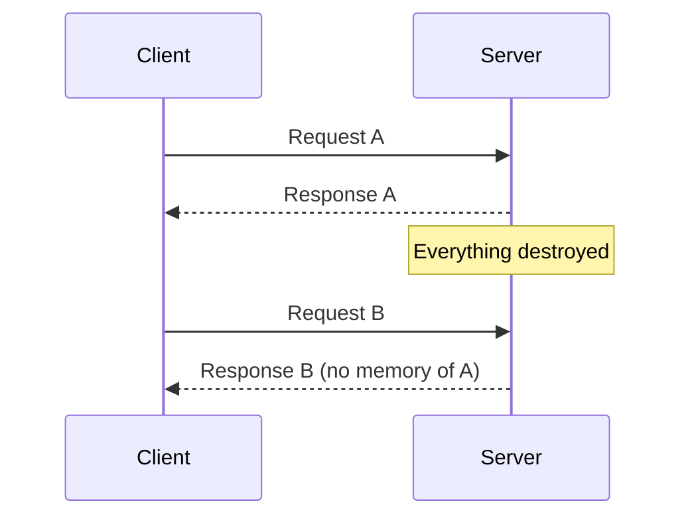
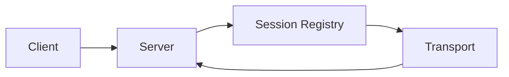
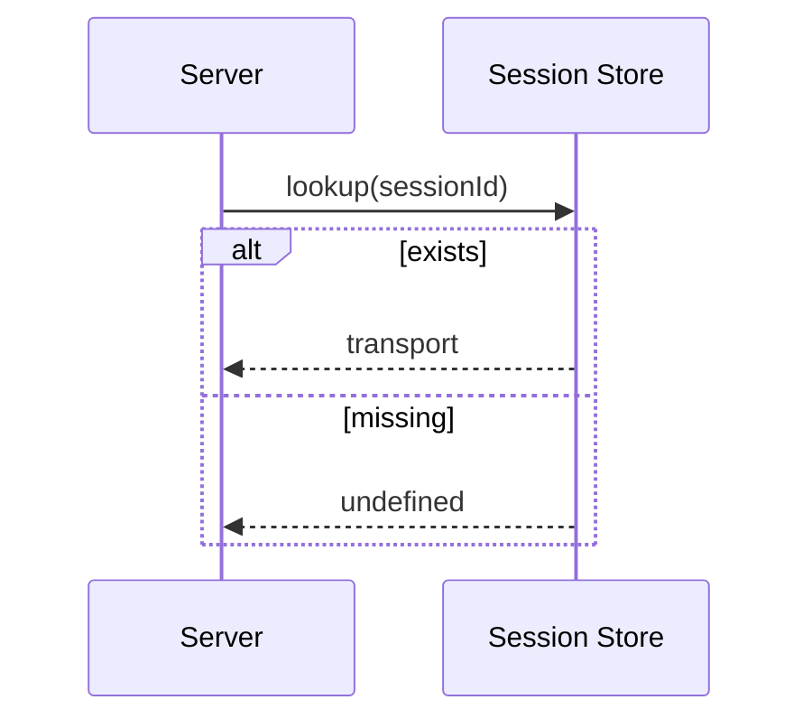
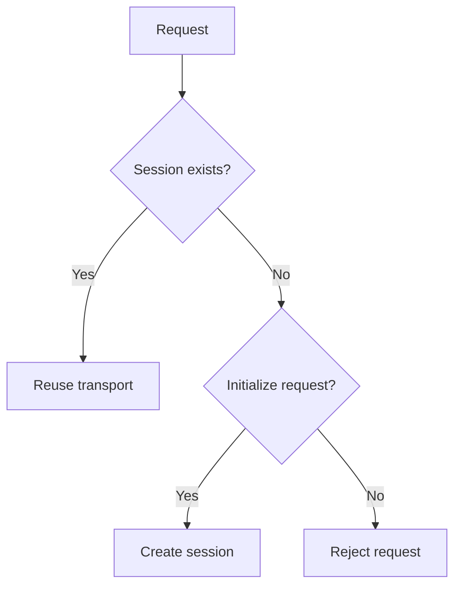
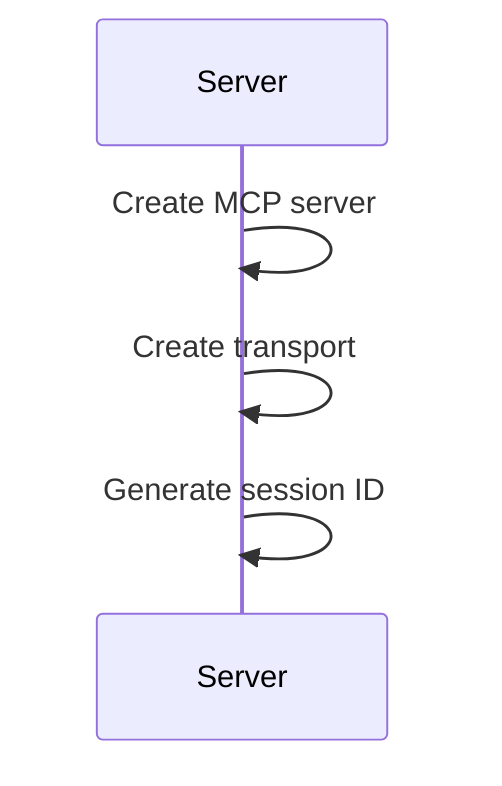
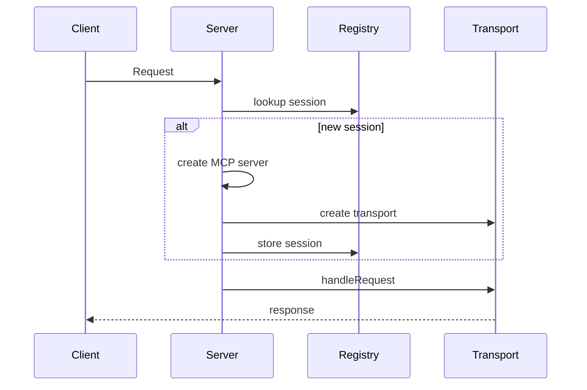
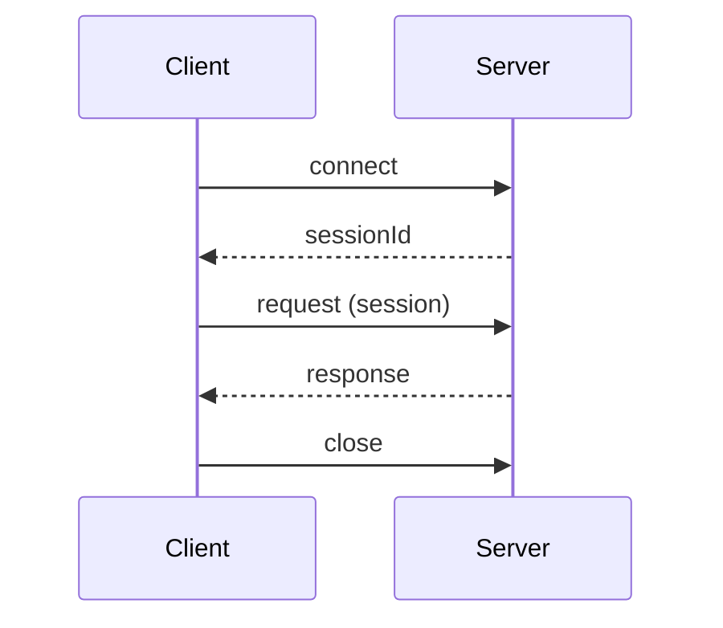
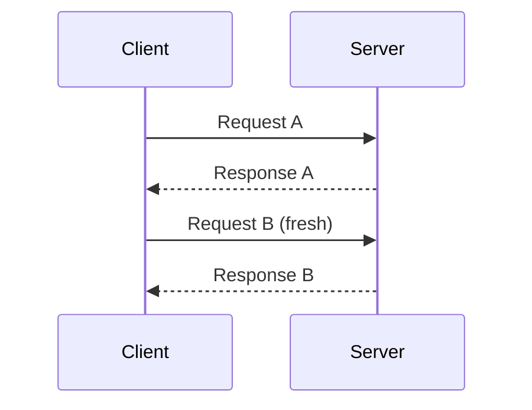
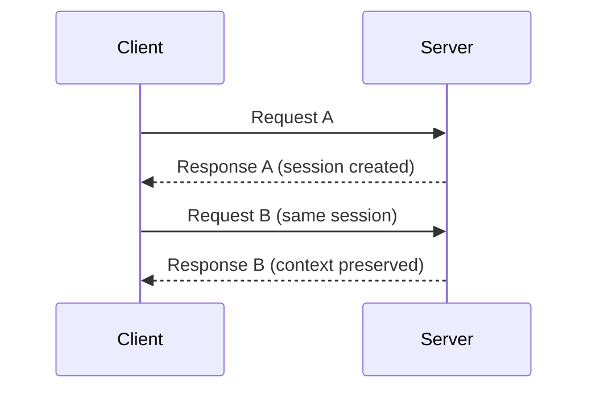
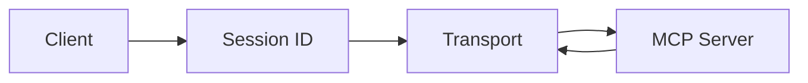

# 📘 Lesson: Building a Stateful HTTP MCP Server

---

## 🟦 Slide 1 — Title

# Stateful HTTP MCP Server

### Building session-aware MCP systems

From stateless requests → persistent AI interactions

---

## 🟦 Slide 2 — Lesson Overview

### In previous lessons:

* Built MCP server using Streamable HTTP transport
* Connected client ↔ server over MCP protocol

### Today:

* Add **state (sessions)** to MCP over HTTP
* Enable multi-request memory
* Build real-world AI agent behavior

---

## 🟦 Slide 3 — The Problem: Stateless Systems

### Current limitation:

> Every request is treated as brand new

### Result:

* No memory
* No continuity
* No conversation history

---

## 🟦 Slide 4 — Stateless Behavior



---

## 🟦 Slide 5 — Stateless vs Stateful

| Feature  | Stateless   | Stateful   |
| -------- | ----------- | ---------- |
| Memory   | None        | Persistent |
| Context  | Lost        | Preserved  |
| Requests | Independent | Connected  |
| Use Case | Simple APIs | AI agents  |

---

## 🟦 Slide 6 — Core Idea: Sessions

### What is a session?

> A persistent identifier linking multiple requests together

### Enables:

* Conversation continuity
* Multi-step workflows
* Agent-like behavior

---

## 🟦 Slide 7 — High-Level Architecture



---

## 🟦 Slide 8 — Session Registry

```ts
const transports: Record<string, StreamableHTTPServerTransport> = {};
```

### What it does:

* Stores active sessions
* Maps:

  * sessionId → transport

### Think of it as:

> “Memory of active conversations”

---

## 🟦 Slide 9 — Extracting Session ID

```ts
const sid = req.headers["mcp-session-id"];
```

### Meaning:

* Check if request belongs to a session
* If yes → reuse state
* If no → create new session

---

## 🟦 Slide 10 — Session Lookup Flow



---

## 🟦 Slide 11 — Reuse vs Create Decision



---

## 🟦 Slide 12 — Initialization Request

### What is it?

> First handshake between client and MCP server

### Purpose:

* Start session
* Allocate resources
* Establish transport

---

## 🟦 Slide 13 — Creating Server + Transport

```ts
const server = new McpServer({...});
```

```ts
const transport = new StreamableHTTPServerTransport({
  sessionIdGenerator: () => randomUUID(),
});
```

---

## 🟦 Slide 14 — Session Creation Flow



---

## 🟦 Slide 15 — Registering Session

```ts
transports[id] = transport;
```

### Meaning:

* Store active session permanently (in memory)
* Enables reuse across requests

---

## 🟦 Slide 16 — Connecting MCP Server

```ts
await server.connect(transport);
```

### What happens:

* MCP logic binds to transport
* Session becomes active
* Ready to handle requests

---

## 🟦 Slide 17 — Handling Requests

```ts
await transport.handleRequest(req, res, req.body);
```

### Responsibilities:

* Route MCP messages
* Execute tools
* Stream responses

---

## 🟦 Slide 18 — Invalid Session Handling

```ts
if (!transport) {
  return res.status(400).json({ error: "Invalid session" });
}
```

### Meaning:

* Reject unknown or broken sessions
* Protect server integrity

---

## 🟦 Slide 19 — Full Server Lifecycle



---

## 🟦 Slide 20 — Client Side State

```ts
let activeSessionId: string | null = null;
```

### Meaning:

* Client remembers session
* Enables continuity across requests

---

## 🟦 Slide 21 — Sending Session ID

```ts
headers: () => ({
  "mcp-session-id": activeSessionId
})
```

### Flow:

Client → Server with session context

---

## 🟦 Slide 22 — Receiving Session ID

```ts
onSessionInitialized: (id) => {
  activeSessionId = id;
}
```

### Meaning:

* Server assigns session
* Client stores it for reuse

---

## 🟦 Slide 23 — Full Client Flow



---

## 🟦 Slide 24 — Final Comparison

### Stateless



### Stateful



---

## 🟦 Slide 25 — Mental Model



---

## 🟦 Slide 26 — Key Takeaways

### You now understand:

* How MCP sessions work over HTTP
* How state is stored via transport mapping
* How clients maintain session continuity
* How stateless HTTP becomes stateful MCP

---

## 🟦 Slide 27 — Next Step

### Coming next:

Build advanced MCP systems with:

* Multi-step workflows
* Context-aware tools
* Persistent agent behavior
* Production-ready patterns

