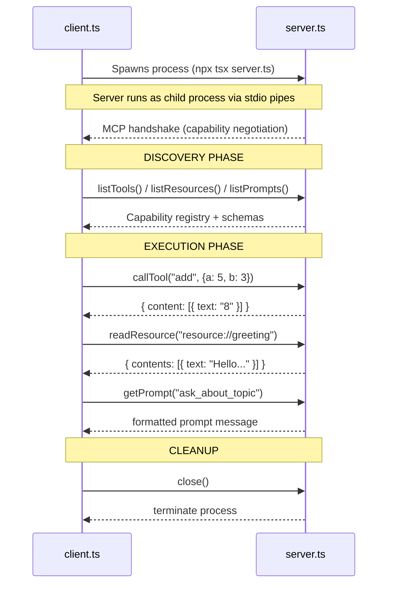
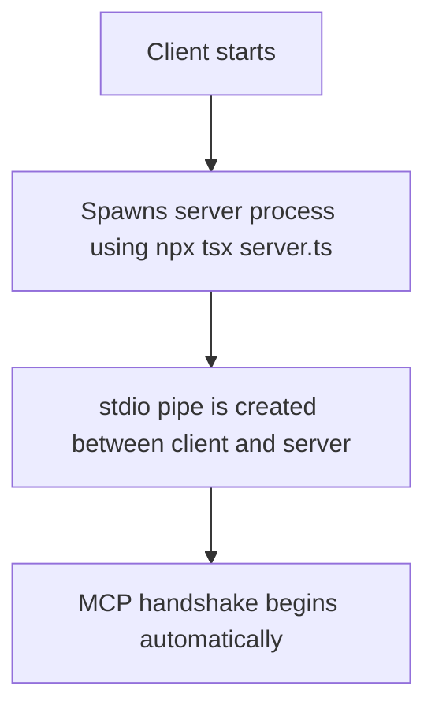
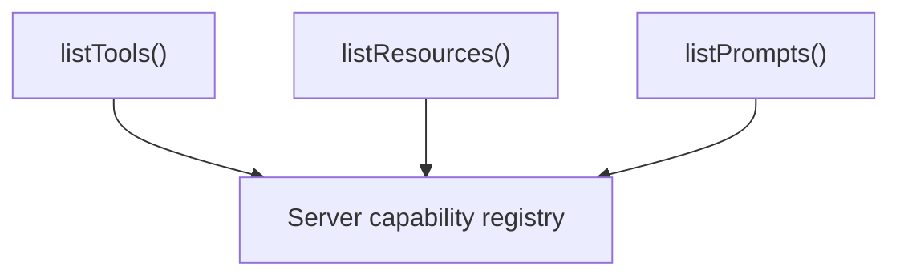
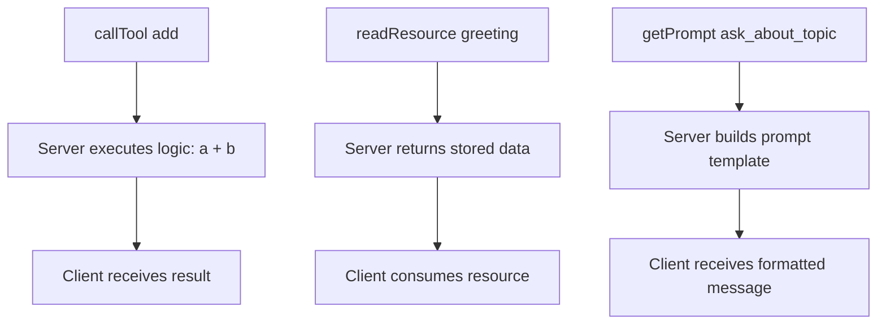
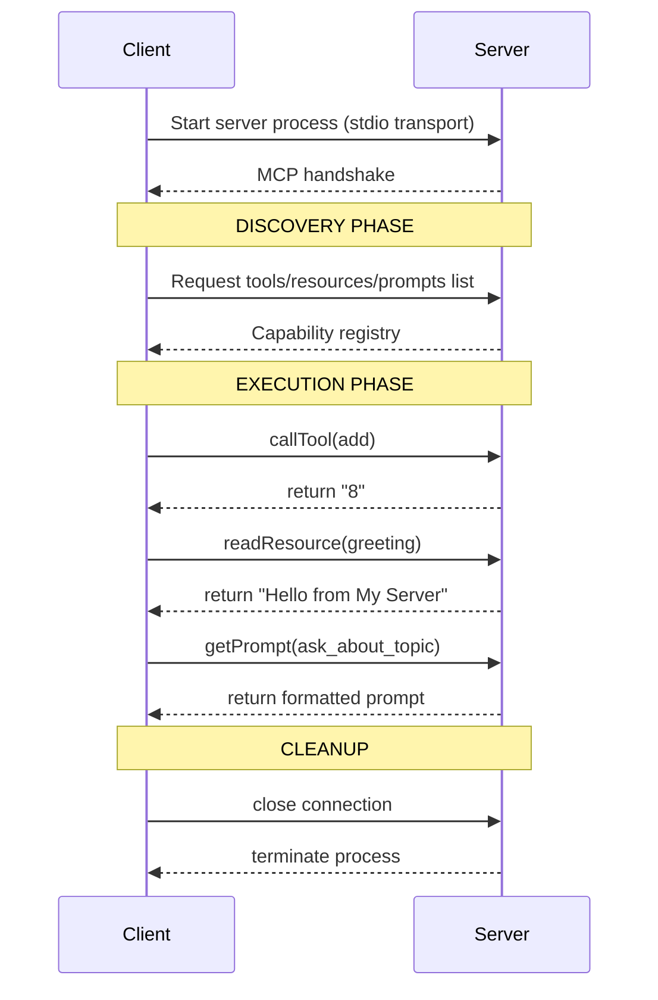
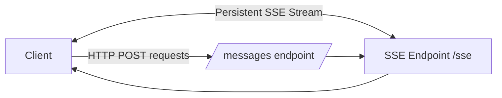
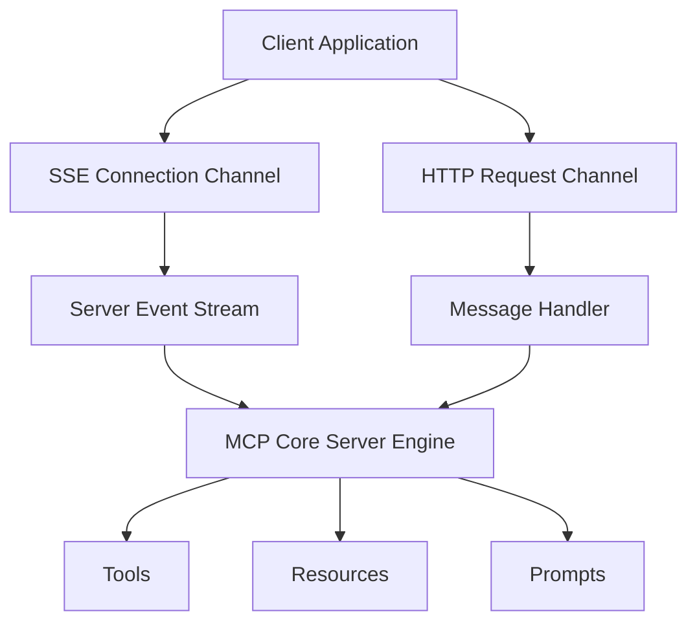
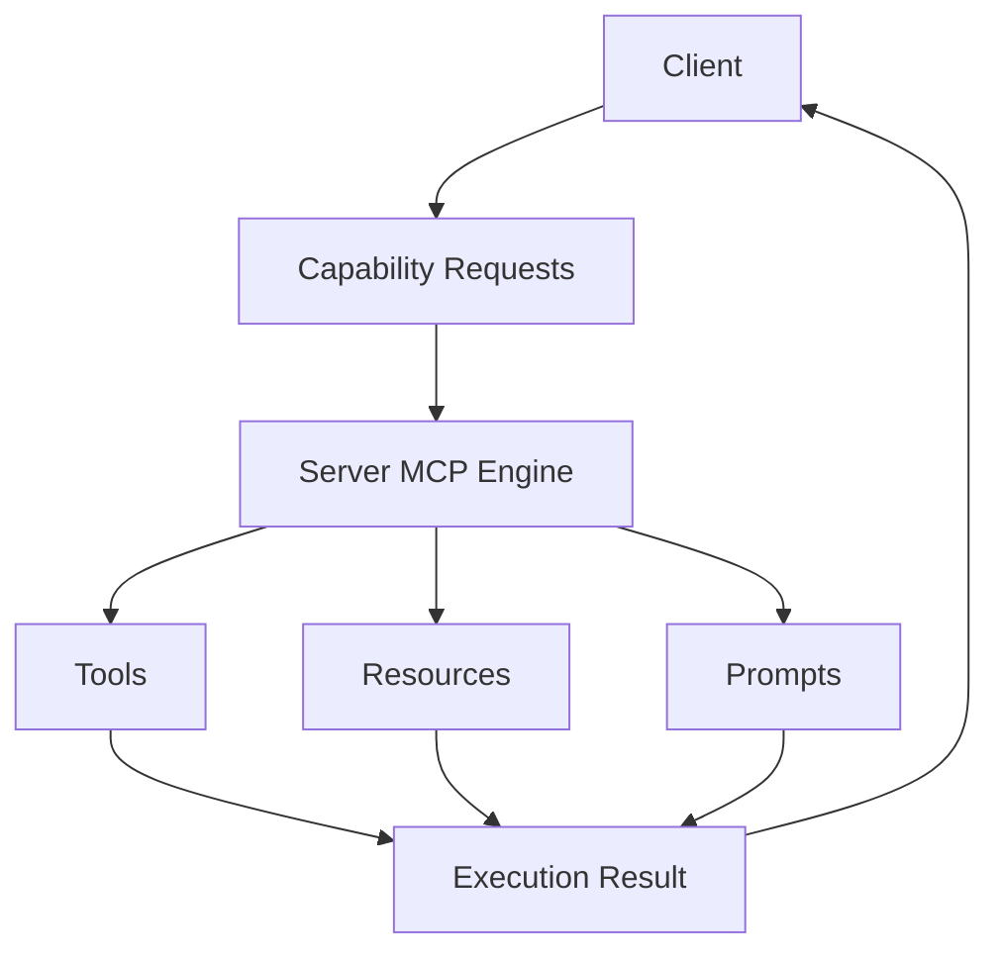

# MCP Protocol: End-to-End Code Walkthrough

This walkthrough explains how the **MCP client (`client.ts`) and server (`server.ts`) work together**.

At a high level, MCP follows a simple lifecycle:

> **Connect → Discover → Execute → Close**

---

# 1. System Overview

You have two processes:

* **client.ts** → starts and controls the MCP session
* **server.ts** → exposes capabilities (tools, resources, prompts)

They communicate over:

> **stdio (standard input/output pipes)**

---

# 2. High-Level Protocol Flow

This diagram shows the full interaction lifecycle between client and server.



---

# 3. Startup Phase (Process Boot)

This is where everything begins.



##What’s happening:

* Client launches the server as a subprocess
* stdio pipes connect both processes
* MCP handshake initializes communication

---

# 4. Discovery Phase (Capability Introspection)

This is where the client asks:

> “What can this server actually do?”



## Explanation:

* Server registers tools, resources, prompts
* Client queries available capabilities
* Nothing is executed yet — only inspection

---

# 5. Execution Phase (Runtime Interaction)

This is where real work happens.



## Meaning:

* **Tools** → execute logic
* **Resources** → fetch data
* **Prompts** → generate structured LLM input

---

# 6. Simplified End-to-End Flow

A beginner-friendly version of the same lifecycle:



---

# 7. Production Architecture (HTTP + SSE)

In production, MCP becomes network-based instead of process-based.



## Explanation:

* **SSE** → server pushes updates continuously
* **HTTP POST** → client sends requests
* Together they simulate full duplex communication

---

# 8. Production System Internals

How the server is structured internally:



## Explanation:

* Everything flows into the MCP core engine
* The engine routes requests to:

  * tools → computation
  * resources → data access
  * prompts → template generation

---

# 9. Core Server Primitives (Recap from Code)

## Tool: `add`

```ts
server.registerTool("add", {...}, async ({ a, b }) => {
  return {
    content: [{ type: "text", text: String(a + b) }],
  };
});
```

---

## Resource: `greeting`

```ts
server.registerResource("greeting", "resource://greeting", {...}, async (uri) => {
  return {
    contents: [{
      uri: uri.href,
      text: "Hello from My Server!",
      mimeType: "text/plain",
    }],
  };
});
```

---

## Prompt: `ask_about_topic`

```ts
server.registerPrompt("ask_about_topic", {...}, ({ topic }) => {
  return {
    messages: [{
      role: "user",
      content: {
        type: "text",
        text: `Can you explain the concept of '${topic}' in simple terms?`,
      },
    }],
  };
});
```

---

# 10. Final Mental Model

MCP is best understood as:



---

# Key Insight

MCP separates two concerns:

* **What the system can do**

  * tools
  * resources
  * prompts

* **How it communicates**

  * stdio (local)
  * HTTP + SSE (production)

---

# Final Takeaway

> MCP is a **transport-agnostic capability runtime** that standardizes how clients interact with server-defined tools, data, and prompt templates.

