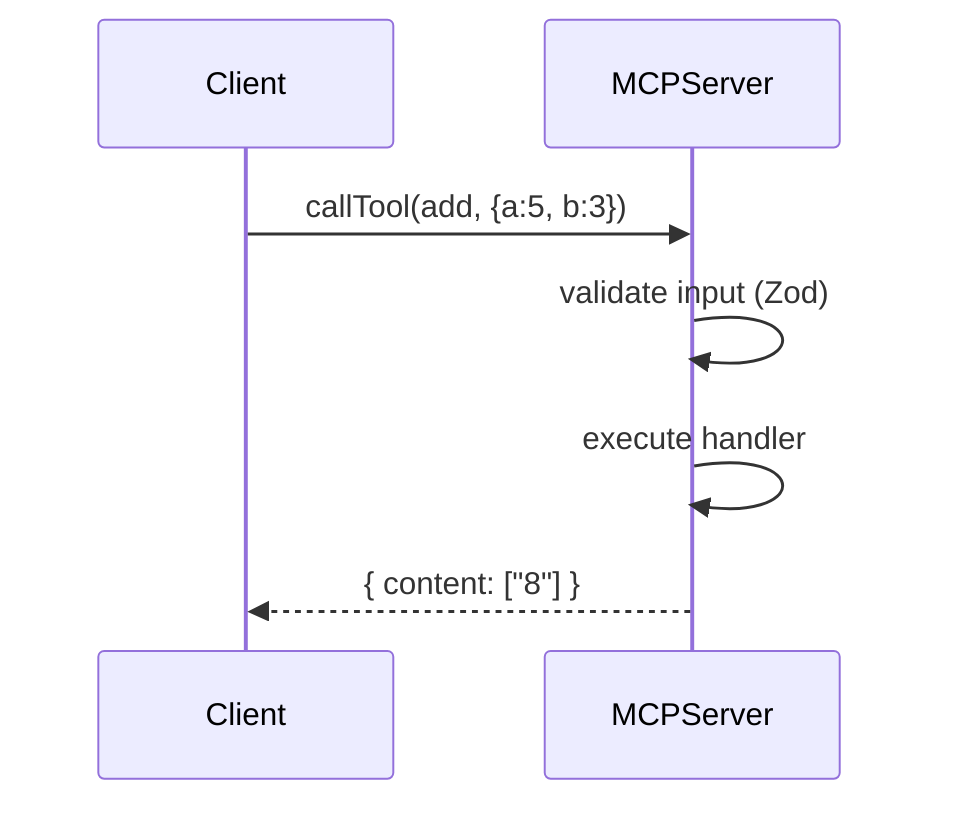
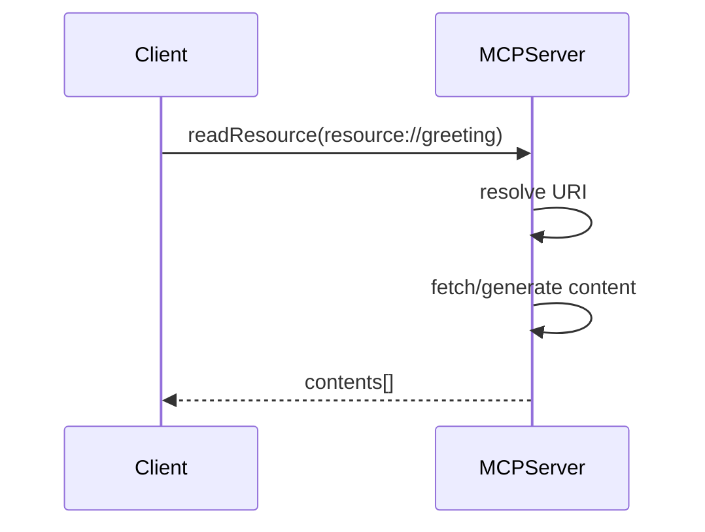
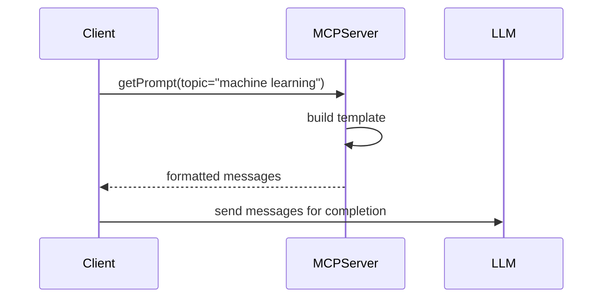
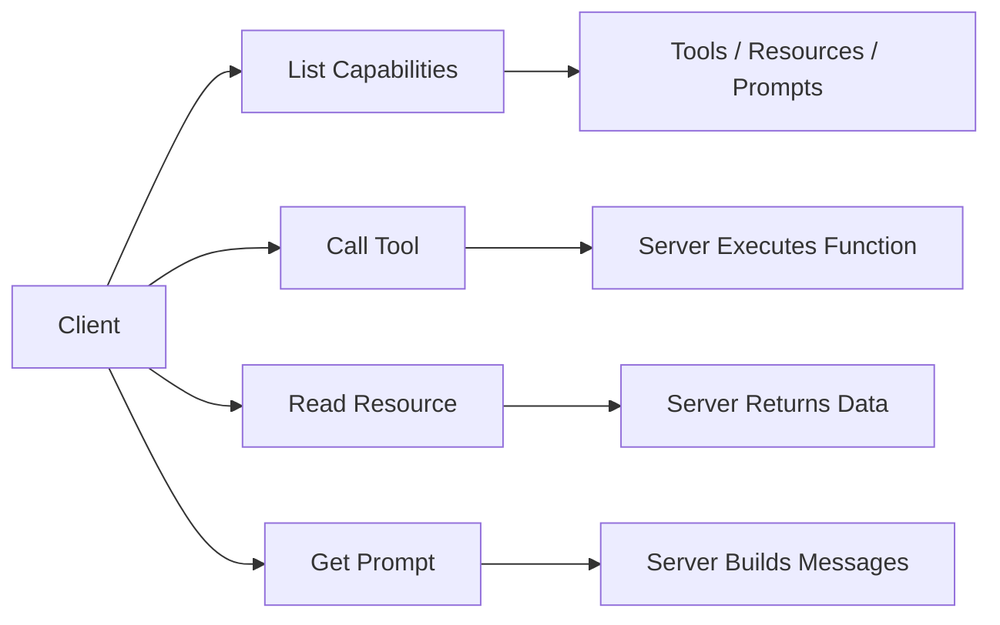

# Lesson: Exploring MCP Server Primitives

---

## Introduction & Lesson Overview

Welcome back!

In the previous lessons, you learned what the **Model Context Protocol (MCP)** is, why it is important, and how to launch a basic MCP server with the official TypeScript SDK. You also explored the two main ways to run your server — using standard input/output (`stdio`) for local communication and HTTP transport for networked scenarios.

By now, you should feel comfortable starting an MCP server and understanding how it fits into the broader AI integration landscape.

In this lesson, we build on that foundation by exploring how to define and expose your server’s capabilities. Specifically, you will learn how to add **tools**, **resources**, and **prompts** to your MCP server.

These are the core building blocks that allow your server to:

- perform actions  
- expose data  
- guide AI behavior  

By the end of this lesson, you will understand how to define each primitive and interact with them from a client. This is a key step toward building powerful, AI-integrated systems.

---

## MCP Server Primitives Overview

To make your MCP server useful, it must expose capabilities that clients (AI agents or applications) can discover and use.

MCP defines three core primitives:

```mermaid
flowchart LR
    A[MCP Server] --> T[Tools]
    A --> R[Resources]
    A --> P[Prompts]

    T --> T1[Actions / Functions]
    R --> R1[Data / Context]
    P --> P1[AI Instructions / Templates]
````

### Tools

**Tools** are executable functions that perform actions or computations.

Examples:

* Add two numbers
* Call an external API
* Process a file

👉 Think of tools as **what the server can DO**.

---

### Resources

**Resources** are data endpoints exposed by the server.

They can be:

* static (e.g., greeting message)
* dynamic (e.g., database records)

👉 Think of resources as **what the server KNOWS**.

---

### Prompts

**Prompts** are reusable templates that generate structured AI instructions.

They help:

* standardize AI queries
* guide model behavior
* create reusable workflows

👉 Think of prompts as **how the AI should be instructed**.

---

## Defining MCP Tools

Tools are registered using `registerTool`.

They include:

* a name
* metadata + schema
* a handler function

---

### Example: Add Tool

```typescript
import { z } from "zod";
import { McpServer } from "@modelcontextprotocol/sdk/server/mcp.js";

const server = new McpServer({
  name: "My Server",
  version: "1.0.0",
  description: "Provides tools, resources, and prompts",
});

server.registerTool(
  "add",
  {
    title: "Addition Tool",
    description: "Return the sum of a and b.",
    inputSchema: {
      a: z.number().describe("First integer"),
      b: z.number().describe("Second integer"),
    },
  },
  async ({ a, b }) => {
    const result = a + b;

    return {
      content: [
        {
          type: "text",
          text: String(result),
        },
      ],
    };
  }
);
```

---

### How Tool Execution Works



---

## Exposing MCP Resources

Resources expose readable data using a **URI-based system**.

---

### Example: Greeting Resource

```typescript
server.registerResource(
  "greeting",
  "resource://greeting",
  {
    title: "Simple Greeting",
    description: "A static greeting message",
    mimeType: "text/plain",
  },
  async (uri) => {
    return {
      contents: [
        {
          uri: uri.href,
          text: "Hello from My Server!",
          mimeType: "text/plain",
        },
      ],
    };
  }
);
```

---

### How Resources Work



---

## Creating MCP Prompts

Prompts are reusable templates that generate structured AI messages.

---

### Example: Topic Prompt

```typescript
server.registerPrompt(
  "ask_about_topic",
  {
    title: "Ask About Topic",
    description: "Generate a question asking for an explanation",
    argsSchema: {
      topic: z.string().describe("Topic to explain"),
    },
  },
  ({ topic }) => {
    return {
      messages: [
        {
          role: "user",
          content: {
            type: "text",
            text: `Can you explain the concept of '${topic}' in simple terms?`,
          },
        },
      ],
    };
  }
);
```

---

### How Prompts Work



---

## MCP Client Connection

Clients connect to MCP servers via a transport layer (e.g., `stdio`).

### Example Setup

```typescript
import { Client } from "@modelcontextprotocol/sdk/client/index.js";
import { StdioClientTransport } from "@modelcontextprotocol/sdk/client/stdio.js";

const transport = new StdioClientTransport({
  command: "npx",
  args: ["tsx", "server.ts"],
});

const client = new Client({
  name: "example-client",
  version: "1.0.0",
});

try {
  await client.connect(transport);

  // interact with server here
} catch (err) {
  console.error(err);
} finally {
  await client.close();
}
```

---

## Discovering Server Capabilities

Once connected, the client can dynamically inspect what the server provides.

```typescript
const tools = await client.listTools();

console.log("Tools:");
tools.tools.forEach(t =>
  console.log(`- ${t.name}: ${t.description}`)
);

const resources = await client.listResources();

console.log("\nResources:");
resources.resources.forEach(r =>
  console.log(`- ${r.uri}`)
);

const prompts = await client.listPrompts();

console.log("\nPrompts:");
prompts.prompts.forEach(p =>
  console.log(`- ${p.name}: ${p.description}`)
);
```

---

## Interacting with MCP Primitives

### 1. Calling a Tool

```typescript
const result = await client.callTool({
  name: "add",
  arguments: { a: 5, b: 3 },
});

console.log(result.content[0].text);
```

Output:

```
8
```

---

### 2. Reading a Resource

```typescript
const res = await client.readResource({
  uri: "resource://greeting",
});

console.log(res.contents[0].text);
```

Output:

```
Hello from My Server!
```

---

### 3. Using a Prompt

```typescript
const prompt = await client.getPrompt({
  name: "ask_about_topic",
  arguments: { topic: "machine learning" },
});

console.log(prompt.messages[0].content.text);
```

Output:

```
Can you explain the concept of 'machine learning' in simple terms?
```

---

## End-to-End MCP Flow



---

## Summary & Next Steps

In this lesson, you learned how to define and use the three core MCP primitives:

| Primitive | Purpose                           |
| --------- | --------------------------------- |
| Tools     | Execute server-side actions       |
| Resources | Expose readable data              |
| Prompts   | Generate reusable AI instructions |

You also learned how a client can:

* connect to an MCP server
* discover capabilities dynamically
* call tools
* read resources
* generate prompts

These primitives form the foundation of MCP-based systems. Mastering them allows you to build flexible, AI-ready servers that can evolve with your applications.

---

## Next Step

In the next lesson, you’ll build your own **custom tools, resources, and prompts from scratch** and combine them into a real-world MCP application.

**Happy coding!**


