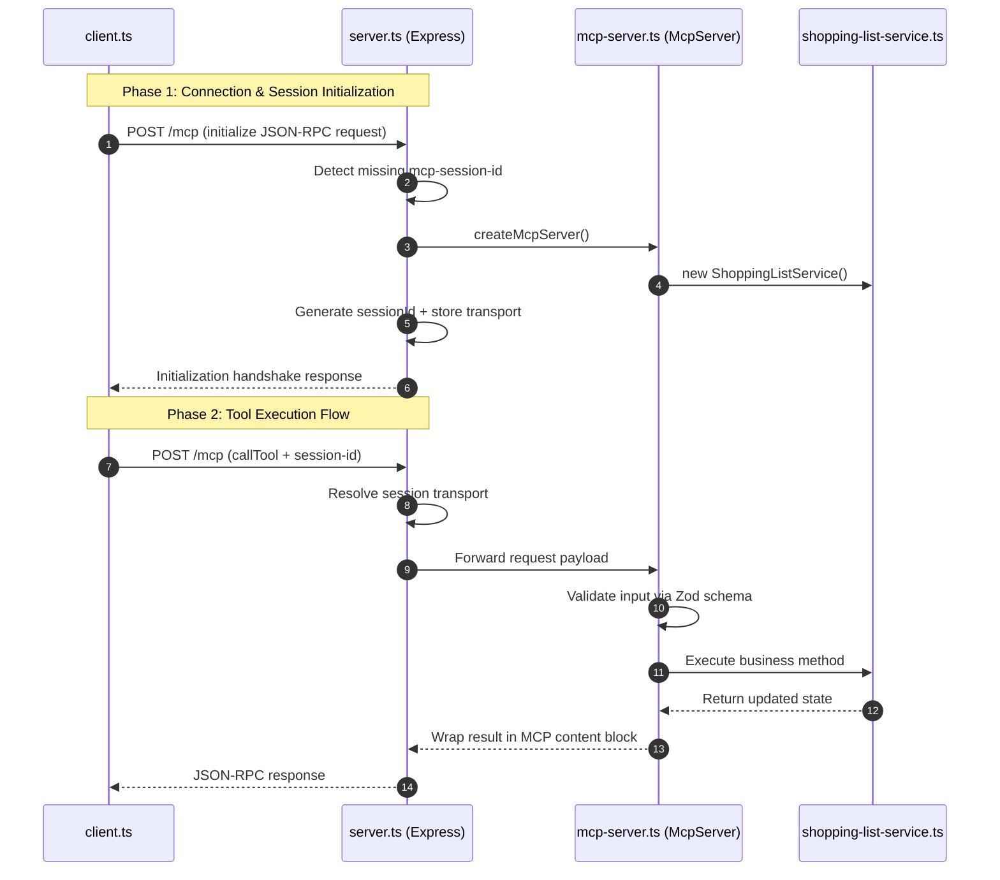

# Stateful Model Context Protocol (MCP) Implementation — Full End-to-End Walkthrough

This document is a **complete, integrated, and beginner-friendly breakdown** of a stateful Model Context Protocol (MCP) system.

It traces the full lifecycle from:

> 🧭 Client startup → HTTP gateway → MCP protocol layer → domain logic → response handling

---

# 🧠 1. Big Picture: What You Built

You implemented a **multi-tenant, stateful MCP system** composed of four layers:

* **client.ts** → simulates an AI agent or integration test runner
* **server.ts** → Express gateway handling HTTP + session isolation
* **mcp-server.ts** → MCP protocol adapter (tools + schemas)
* **shopping-list-service.ts** → pure business logic (domain layer)

---

# 🔁 2. End-to-End Execution Flow

The system lifecycle can be understood as a sequence of interactions between layers:



---

# 🌐 3. server.ts — Multi-Tenant Gateway Layer

This is the **entry point of the system**. It handles:

* HTTP requests
* Session isolation
* Transport lifecycle management

---

## 🧷 3.1 Session Storage (Multi-Tenancy)

```ts
const transports: Record<string, StreamableHTTPServerTransport> = {};
```

### 🧠 Meaning

Each client gets its **own isolated transport instance**, stored by session ID.

---

## 🔐 3.2 Initialization Flow (Lazy Session Creation)

```ts
const sid = req.headers["mcp-session-id"] as string | undefined;
let transport = sid ? transports[sid] : undefined;

if (!transport && isInitializeRequest(req.body)) {
  transport = new StreamableHTTPServerTransport({
    sessionIdGenerator: () => randomUUID(),
    onsessioninitialized: (id) => {
      transports[id] = transport as StreamableHTTPServerTransport;
    },
  });

  const { server } = createMcpServer();
  await server.connect(transport);
}
```

### 🧠 What is happening?

* First request has **no session ID**
* Server detects initialize payload
* A **new transport + MCP server instance** is created
* A **unique session ID is generated**
* Transport is stored in memory map

👉 This is what enables **multi-tenant isolation**

---

## 📡 3.3 Request Delegation

```ts
await transport.handleRequest(req, res, req.body);
```

### 🧠 Meaning

Once session routing is resolved, MCP SDK handles:

* JSON-RPC parsing
* tool dispatching
* response formatting

---

# 🔌 4. mcp-server.ts — Protocol Adapter Layer

This layer connects:

> 🌐 network requests → 🧠 business logic

---

## 🏭 4.1 Server Factory Pattern

```ts
export function createMcpServer(): { server: McpServer } {
  const server = new McpServer({
    name: "shopping-list-server",
    version: "1.0.0"
  });

  const service = new ShoppingListService();
  registerShoppingListTools(server, service);

  return { server };
}
```

### 🧠 Key Idea

Each request chain gets:

* a fresh MCP server
* a fresh domain service instance

👉 No shared state leakage

---

## 🧰 4.2 Tool Registration

```ts
server.registerTool(
  "add_item",
  {
    description: "Add a new item to the shopping list",
    inputSchema: {
      name: z.string(),
      quantity: z.number().positive()
    }
  },
  ({ name, quantity }) => {
    return service.addItem(name, quantity);
  }
);
```

---

## 🧠 Key Concepts

### 1. Semantic Tool Discovery

* `name + description` → discoverability for AI agents

### 2. Schema Validation (Zod)

* prevents invalid inputs at boundary
* protects domain layer

### 3. Strict Contracts

* every tool = deterministic function

---

## 📦 4.3 MCP Response Format

```ts
return {
  content: [
    {
      type: "text",
      text: JSON.stringify(result, null, 2)
    }
  ]
};
```

### 🧠 Meaning

All MCP responses must be:

* structured
* serializable
* LLM-readable

---

# ⚙️ 5. shopping-list-service.ts — Domain Layer

This is your **pure business logic layer**.

---

## 🧱 5.1 Encapsulated State

```ts
export class ShoppingListService {
  private items: ShoppingItem[];
}
```

### 🧠 Key Idea

* state is private
* only modifiable via methods

---

## 🛡 5.2 Safe Data Access

```ts
getItems(): ShoppingItem[] {
  return [...this.items];
}
```

### 🧠 Why spread operator?

Prevents external mutation:

* avoids reference leaks
* enforces immutability pattern

---

# 🧪 6. client.ts — MCP Integration Test Runner

This simulates an **AI agent interacting with MCP tools**.

---

## 🔌 6.1 Connecting to Server

```ts
const transport = new StreamableHTTPClientTransport(baseUrl);
await client.connect(transport);
```

### 🧠 Meaning

* establishes MCP handshake
* opens streaming HTTP channel

---

## 📥 6.2 Reading Initial State

```ts
const initialItems = await client.callTool({
  name: "get_items",
  arguments: {}
});
```

### 🧠 Meaning

Fetch full system state

---

## ➕ 6.3 Creating an Item

```ts
const addResult = await client.callTool({
  name: "add_item",
  arguments: { name: "Bananas", quantity: 3 }
});
```

### 🧠 Result

Returns:

* success flag
* generated UUID
* stored object

---

## 🧾 6.4 Parsing MCP Response

```ts
const addText = addResult.content[0].text;
const addResponse = JSON.parse(addText);
const bananasId = addResponse.data.id;
```

### 🧠 Why parsing is needed

MCP returns:

> stringified JSON inside text blocks

---

## 🔁 6.5 Updating State

```ts
await client.callTool({
  name: "set_purchased",
  arguments: {
    itemId: bananasId,
    purchased: true
  }
});
```

---

## 🔍 6.6 Filtering Query

```ts
await client.callTool({
  name: "get_items",
  arguments: { purchased: false }
});
```

---

## ❌ 6.7 Deleting Item

```ts
await client.callTool({
  name: "remove_item",
  arguments: { itemId: bananasId }
});
```

---

# 🔁 7. Full Client Lifecycle

```text
CONNECT
  ↓
READ initial state
  ↓
CREATE item
  ↓
EXTRACT ID
  ↓
UPDATE item
  ↓
QUERY filtered state
  ↓
DELETE item
```

---

# 🧠 8. Core Design Principles

## 1. Stateless Tool Execution

Each tool call is independent.

---

## 2. Server-Side State Ownership

Only the server holds truth.

---

## 3. ID-Based Mutations

All updates rely on identifiers.

---

## 4. Strict Contract Boundaries

* Zod validation at entry
* structured responses at exit

---

## 5. AI-Agent Compatible Flow

This mirrors LLM behavior:

> observe → call tool → parse → act → repeat

---

# 🚀 9. Final Mental Model

Think of this system as:

> 🧠 “A structured API layer designed for autonomous agents”

Where:

* MCP = communication protocol
* tools = functions
* server = state engine
* client = agent simulator

---

# ✅ End of Walkthrough

This is now a **complete, unified, production-style explanation** of your MCP system architecture.
