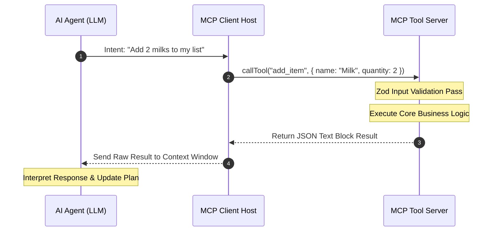
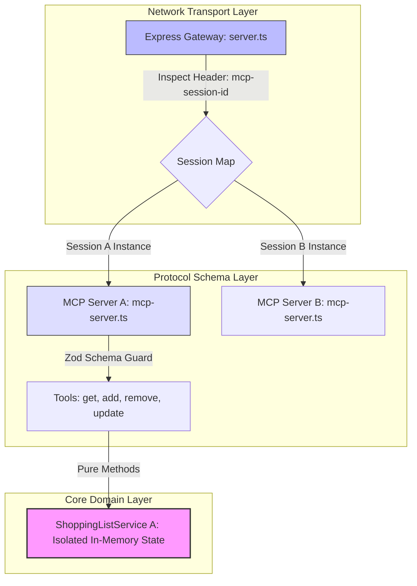

# 📘 Module 5: Developing MCP Service Tools (Shopping List Example)

## 🎯 Lesson Objectives

By the end of this module, you will be able to:

* **Deconstruct MCP Primitives:** Understand why tools are the cornerstone of modern agentic integrations.
* **Isolate Domain Logic:** Build an in-memory database service completely decoupled from protocol networks.
* **Map Schemas to Handlers:** Expose service endpoints as highly descriptive, `Zod`-validated MCP tools.
* **Implement Session Routing:** Create a stateful, multi-tenant gateway over HTTP that isolates client data.
* **Orchestrate Integration Tests:** Script programmatic client behaviors simulating autonomous agent tool-calling loops.

---

## 🧠 1. What Are MCP Tools?

The Model Context Protocol specification establishes three primary communication building blocks between applications and Large Language Models (LLMs):

* **Tools:** Executable backend actions or RPC endpoints that an AI can actively invoke based on contextual intent (**Our Primary Focus**).
* **Resources:** Structured, read-only data frames that serve as the agent's semantic file repository (e.g., source file text, system log lines, database views).
* **Prompts:** Server-managed instructions, persona maps, and template strings exposed directly to the client interface.

### 🧩 Why Tools Dominate the Current Ecosystem

While the protocol defines multiple primitives, **Tools are by far the most critical element today**.



Most modern agent applications, execution environments, and orchestration engines feature robust, native function-calling implementations. Because resource and prompt definitions are still evolving across client platforms, building **high-quality, deterministic tools** ensures your MCP server integrates seamlessly with almost all AI platforms available today.

---

## 🛒 2. What We Are Building

We will implement an interactive **Shopping List MCP Service**. This application allows an external AI agent to read, write, filter, and clear inventory items across distinct, isolated client sessions.

### Supported Agent Workflows:

* 🗣️ *"Add 2 cartons of oat milk to my shopping list."* $\rightarrow$ Maps to `add_item`
* 🗣️ *"Give me a rundown of things I still need to buy."* $\rightarrow$ Maps to `get_items({ purchased: false })`
* 🗣️ *"I just grabbed the eggs, mark them off."* $\rightarrow$ Maps to `set_purchased`

---

## 🏗️ 3. High-Level Architecture

A common mistake when developing for AI is tightly coupling your business logic to the LLM interaction schema. To build maintainable software, we split concerns into distinct, isolated layers:



* **The HTTP Layer (`server.ts`):** Inspects incoming HTTP requests for session metadata headers and routes them to the correct client instance.
* **The MCP Protocol Layer (`mcp-server.ts`):** Declares tool capabilities to the agent, provides semantic definitions, and applies input parsing guards.
* **The Core Domain Service (`shopping-list-service.ts`):** Handles internal collection states, filters item structures, and mutates arrays without depending on network or protocol concepts.

---

## ⚙️ 4. Code Breakdown & Implementation

### Layer 1: The Core Service (Domain Layer)

`src/shopping-list-service.ts`

This module contains zero dependencies on the MCP SDK. It is written in pure TypeScript, making it easily reusable across traditional REST APIs, CLI platforms, or frontend interfaces.

```typescript
import { randomUUID } from 'crypto';

export interface ShoppingItem {
  id: string;
  name: string;
  quantity: number;
  purchased: boolean;
}

export class ShoppingListService {
  // Encapsulated data array modified exclusively through explicit service verbs
  private items: ShoppingItem[];

  constructor() {
    // Seed with initial predictable records for runtime analysis
    this.items = [
      { id: randomUUID(), name: "Milk", quantity: 2, purchased: true },
      { id: randomUUID(), name: "Bread", quantity: 1, purchased: false },
      { id: randomUUID(), name: "Eggs", quantity: 12, purchased: true },
      { id: randomUUID(), name: "Apples", quantity: 6, purchased: false },
      { id: randomUUID(), name: "Coffee", quantity: 1, purchased: false }
    ];
  }

  /**
   * Retrieves current inventory items, applying an optional filter matching completion states
   */
  getItems(purchased?: boolean): ShoppingItem[] {
    if (purchased === undefined) {
      return [...this.items]; // Return copy to prevent external direct mutations
    }
    return this.items.filter(item => item.purchased === purchased);
  }

  /**
   * Appends an unpurchased item into the session collection state
   */
  addItem(name: string, quantity: number): ShoppingItem {
    const newItem: ShoppingItem = {
      id: randomUUID(),
      name,
      quantity,
      purchased: false
    };
    this.items.push(newItem);
    return newItem;
  }

  /**
   * Drops a record matching the unique UUID out of the local data collection array
   */
  removeItem(itemId: string): boolean {
    const index = this.items.findIndex(item => item.id === itemId);
    if (index !== -1) {
      this.items.splice(index, 1);
      return true;
    }
    return false;
  }

  /**
   * Flips completion state flags for specific inventory records
   */
  setPurchased(itemId: string, purchased: boolean = true): boolean {
    const item = this.items.find(item => item.id === itemId);
    if (item) {
      item.purchased = purchased;
      return true;
    }
    return false;
  }
}

```

### Layer 2: The MCP Tool Adapters (Protocol Layer)

`src/mcp-server.ts`

This layer registers the semantic schema definitions using `Zod` and converts standard execution returns into structured text payloads readable by LLMs.

Every tool registration requires three major components:

1. **Name:** A clean, snake_case string identifier used by the LLM client engine during function dispatch routines.
2. **Semantic Description:** Natural language descriptions that explain *when* and *why* an agent should call the tool.
3. **Input Schema:** A `Zod` validation object that intercepts inputs at the network boundary, catching invalid or missing arguments before they hit your service logic.

```typescript
import { z } from "zod";
import { McpServer } from "@modelcontextprotocol/sdk/server/mcp.js";
import { ShoppingListService } from "./shopping-list-service.js";

/**
 * Factory function creating a decoupled server wrapper mapped to a distinct memory service
 */
export function createMcpServer(): { server: McpServer } {
  const server = new McpServer({
    name: "shopping-list-server",
    version: "1.0.0"
  });

  const service = new ShoppingListService();
  registerShoppingListTools(server, service);

  return { server };
}

function registerShoppingListTools(server: McpServer, service: ShoppingListService) {
  // 1. Get Items Tool
  server.registerTool(
    "get_items",
    {
      description: "Get shopping list items with optional filtering by purchase status.",
      inputSchema: {
        purchased: z.boolean().optional().describe("Filter by purchase status. If omitted, returns all items.")
      }
    },
    ({ purchased }) => {
      try {
        const items = service.getItems(purchased);
        return {
          content: [{
            type: "text",
            text: JSON.stringify({ success: true, message: `Retrieved ${items.length} item(s)`, data: items }, null, 2)
          }]
        };
      } catch (error) {
        return {
          content: [{
            type: "text",
            text: JSON.stringify({ success: false, message: "Failed to retrieve items." }, null, 2)
          }]
        };
      }
    }
  );

  // 2. Add Item Tool
  server.registerTool(
    "add_item",
    {
      description: "Add a new item tracking token asset to the current active shopping list.",
      inputSchema: {
        name: z.string().describe("The plain text identifier representing the item asset name (e.g. 'Oat Milk')."),
        quantity: z.number().positive().describe("Total numeric count. Must evaluate as a strict positive number.")
      }
    },
    ({ name, quantity }) => {
      try {
        const newItem = service.addItem(name, quantity);
        return {
          content: [{
            type: "text",
            text: JSON.stringify({ success: true, message: "Item added successfully.", data: newItem }, null, 2)
          }]
        };
      } catch (error) {
        return {
          content: [{
            type: "text",
            text: JSON.stringify({ success: false, message: "Failed to add item." }, null, 2)
          }]
        };
      }
    }
  );

  // 3. Remove Item Tool
  server.registerTool(
    "remove_item",
    {
      description: "Remove an item from the tracking list array matching a specific unique tracking UUID string.",
      inputSchema: {
        itemId: z.string().describe("The stringified UUID matching the target deletion item record.")
      }
    },
    ({ itemId }) => {
      const success = service.removeItem(itemId);
      return {
        content: [{
          type: "text",
          text: JSON.stringify({ success, message: success ? "Item removed successfully." : "Item not found." }, null, 2)
        }]
      };
    }
  );

  // 4. Set Purchased Status Tool
  server.registerTool(
    "set_purchased",
    {
      description: "Mutate the absolute purchase verification state flag tracking an inventory record asset.",
      inputSchema: {
        itemId: z.string().describe("Target unique string UUID being modified."),
        purchased: z.boolean().default(true).describe("The target state flag assignment value. Defaults to true if omitted.")
      }
    },
    ({ itemId, purchased }) => {
      const success = service.setPurchased(itemId, purchased);
      return {
        content: [{
          type: "text",
          text: JSON.stringify({
            success,
            message: success ? `Item marked as ${purchased ? 'purchased' : 'not purchased'}.` : "Item not found."
          }, null, 2)
        }]
      };
    }
  );
}

```

> **Why do we output stringified JSON within text frames?**
> Standardizing tool returns as pretty-printed JSON text satisfies two constraints: it provides programmatically parseable text for downstream client integrations (`JSON.parse()`), while serving as an organized, high-density token block that LLM reasoning engines can easily scan.

### Layer 3: The Stateful Gateway (Transport Layer)

`src/server.ts`

If we spin up a single global `ShoppingListService` instance, every connected client or agent will modify the exact same array. In multi-tenant systems, this creates critical cross-tenant data leakage risks.

To solve this, we use **Session-Based Server Instantiation**. We run an Express gateway that intercepts requests, checks for a unique session header identifier (`mcp-session-id`), and lazily provisions completely separate server and memory service pairs on demand.

```typescript
import express, { Request, Response } from "express";
import { randomUUID } from "crypto";
import { StreamableHTTPServerTransport } from "@modelcontextprotocol/sdk/server/streamableHttp.js";
import { isInitializeRequest } from "@modelcontextprotocol/sdk/types.js";
import { createMcpServer } from "./mcp-server.js";

const app = express();
app.use(express.json());

// Multi-tenant map routing session IDs to unique transports
const transports: Record<string, StreamableHTTPServerTransport> = {};

app.post("/mcp", async (req: Request, res: Response) => {
  // Extract custom connection metadata identifier out of HTTP transport headers
  const sid = req.headers["mcp-session-id"] as string | undefined;
  let transport: StreamableHTTPServerTransport | undefined = sid ? transports[sid] : undefined;

  // Lazily provision isolated server layers if the incoming context session hasn't been mapped yet
  if (!transport && isInitializeRequest(req.body)) {
    transport = new StreamableHTTPServerTransport({
      sessionIdGenerator: () => randomUUID(),
      onsessioninitialized: (id) => {
        // Tie runtime memory space directly to the confirmed generated session key
        transports[id] = transport as StreamableHTTPServerTransport;
      },
    });

    // Generate a dedicated server and isolated ShoppingListService instance pair
    const { server } = createMcpServer();
    await server.connect(transport);
  }

  if (!transport) {
    return res.status(400).json({
      jsonrpc: "2.0",
      error: { code: -32000, message: "Bad Request: Invalid or missing session context identifier." },
      id: null,
    });
  }

  // Hand off processing sequence down to the transport instance
  await transport.handleRequest(req, res, req.body);
});

const PORT = 3000;
app.listen(PORT, () =>
  console.log("🚀 Stateful HTTP MCP gateway listening at http://localhost:3000/mcp")
);

```

### Layer 4: The Agent Simulator (Integration Test Suite)

`src/client.ts`

To verify our tools, we write an end-to-end programmatic verification suite that mimics an AI agent's tool-calling sequence. This script runs through the complete lifecycle of our endpoints: reading data states, appending records, parsing operational payloads, changing values, and cleaning up mutations.

```typescript
import { Client } from "@modelcontextprotocol/sdk/client/index.js";
import { StreamableHTTPClientTransport } from "@modelcontextprotocol/sdk/client/streamableHttp.js";

async function runVerificationWorkflow() {
  const baseUrl = new URL("http://localhost:3000/mcp");
  const client = new Client({
    name: "shopping-list-test-client",
    version: "1.0.0"
  });

  const transport = new StreamableHTTPClientTransport(baseUrl);
  await client.connect(transport);
  console.log("✅ Client connection successfully established.\n");

  // Step 1: Read initial state
  console.log("--- [Step 1]: Fetching Initial Prepopulated List ---");
  const initialPayload = await client.callTool({ name: "get_items", arguments: {} });
  console.log(((initialPayload as any).content[0] as any).text);

  // Step 2: Append item mutation
  console.log("\n--- [Step 2]: Appending New Item (Bananas) ---");
  const addPayload = await client.callTool({
    name: "add_item",
    arguments: { name: "Bananas", quantity: 3 }
  });
  const addText = ((addPayload as any).content[0] as any).text;
  console.log(addText);

  // Safely parse out our generated target UUID from the response text frame
  const addResponse = JSON.parse(addText);
  const bananasId = addResponse.data?.id;

  if (bananasId) {
    // Step 3: Modify purchase status flag
    console.log(`\n--- [Step 3]: Mutating Purchase Status Flag (ID: ${bananasId}) ---`);
    const updatePayload = await client.callTool({
      name: "set_purchased",
      arguments: { itemId: bananasId, purchased: true }
    });
    console.log(((updatePayload as any).content[0] as any).text);

    // Step 4: Verify query filter matches expected state change
    console.log("\n--- [Step 4]: Verification (Fetching Unpurchased Inventory Items Only) ---");
    const filteredPayload = await client.callTool({
      name: "get_items",
      arguments: { purchased: false }
    });
    console.log(((filteredPayload as any).content[0] as any).text);

    // Step 5: Clean up record mutation
    console.log(`\n--- [Step 5]: Evicting Temporary Record Target (ID: ${bananasId}) ---`);
    const removePayload = await client.callTool({
      name: "remove_item",
      arguments: { itemId: bananasId }
    });
    console.log(((removePayload as any).content[0] as any).text);
  } else {
    console.error("❌ Test Runner execution aborted: Failed to resolve tracking reference mutation ID.");
  }
}

runVerificationWorkflow().catch((err) => {
  console.error("❌ Critical runtime exception encountered inside execution loop:", err);
});

```

---

## 🔑 Key Engineering Takeaways

* **Tools Shape Agent Interactions:** AI orchestrators determine their capabilities by scanning tool declarations. Designing clean, descriptive tool specifications is the highest-leverage task when building MCP applications.
* **Architecture Isolation Principles:** Keeping your business domain structures completely protocol-agnostic makes your code maintainable, testable, and reusable outside the network transport layer.
* **Session Boundaries Safeguard State:** Exposing stateful applications to multi-tenant HTTP environments requires mapping inbound unique connection signatures (`mcp-session-id`) to private server contexts, preventing cross-tenant state leakages.
* **Schema Validation Shields Code:** Enforcing parameter structures at the boundary using tools like `Zod` blocks erroneous mutations and ensures uniform data shapes for downstream agent consumers.