# **Slide 1 — Title**

## Building a Stateful MCP Server (HTTP)

### From Stateless Requests → Session-Aware Systems

We are upgrading an MCP server from a simple request handler into a system that can **remember clients across multiple interactions**.

---

# **Slide 2 — Where You Are Now**

You already built:

* MCP server using Express.js
* Streamable HTTP transport
* MCP client
* Working request/response flow

### But currently:

> Every request is treated as completely new

---

### Sequence Diagram (Stateless Requests)

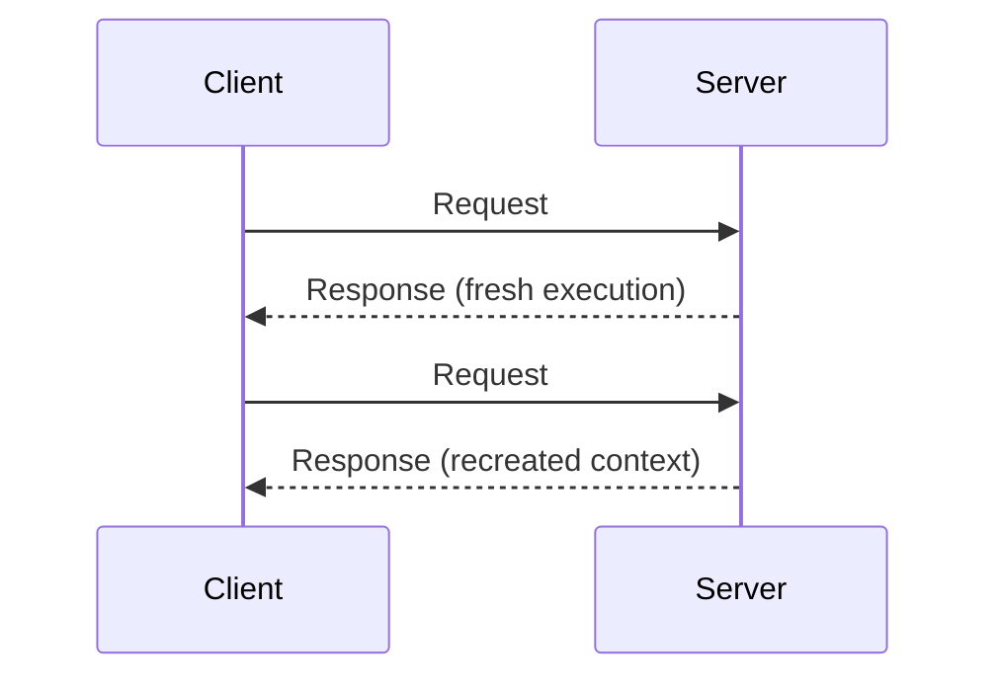

---

# **Slide 3 — Stateless System (Concept)**

A stateless server means:

* No memory between requests
* No user identity
* No session tracking

---

### Sequence Diagram

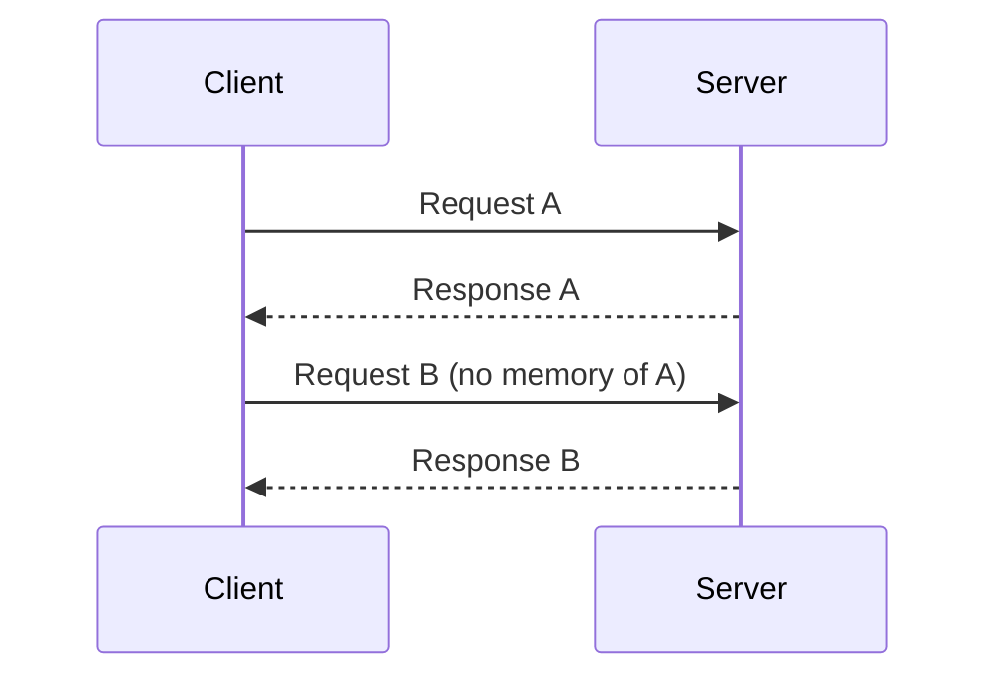

---

# **Slide 4 — Why Stateless is Limited**

Stateless systems cannot:

* Track users
* Resume workflows
* Maintain context
* Support multi-step interactions

---

# **Slide 5 — What We Want: Stateful MCP Server**

We introduce **state (memory)**.

We want the server to:

* Recognize returning clients
* Continue sessions
* Store session context
* Support multi-step workflows

---

### Sequence Diagram (Stateful Flow)

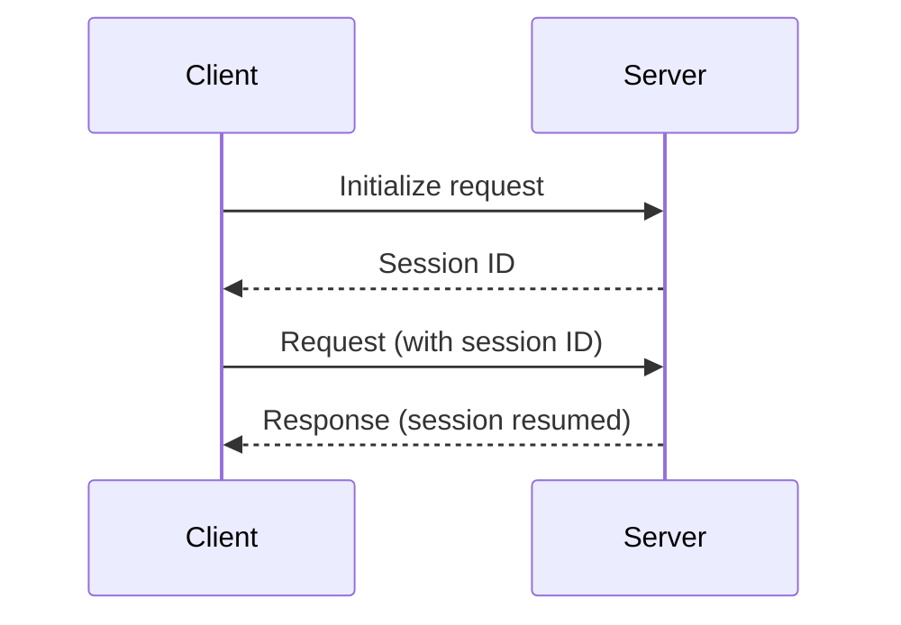

---

# **Slide 6 — What is a Session?**

A **session** is:

> A memory container for one client lifecycle

It stores:

* Session ID
* Transport connection
* MCP context

---

### Sequence Diagram

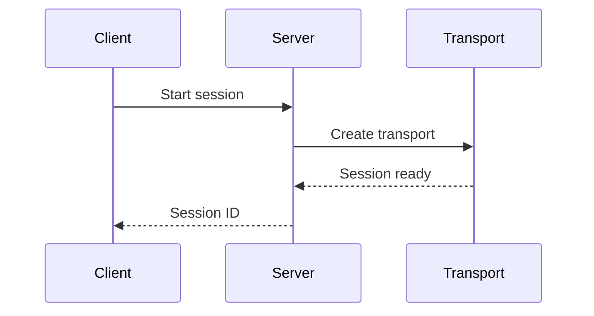

---

# **Slide 7 — Core Idea**

We store sessions like this:

```ts
sessionId → transport
```

---

### Diagram (Session Store)

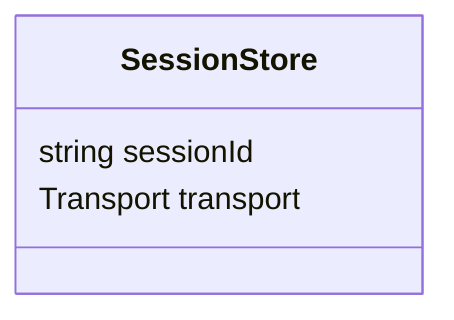

---

# **Slide 8 — Step 1: Create Session Store**

```ts
const transports: Record<string, StreamableHTTPServerTransport> = {};
```

---

### Sequence Diagram

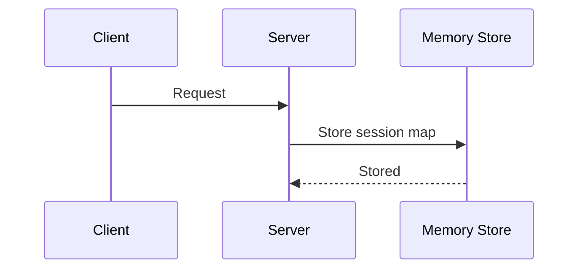

---

# **Slide 9 — Step 2: Extract Session ID**

```ts
const sid = req.headers["mcp-session-id"];
```

---

### Sequence Diagram

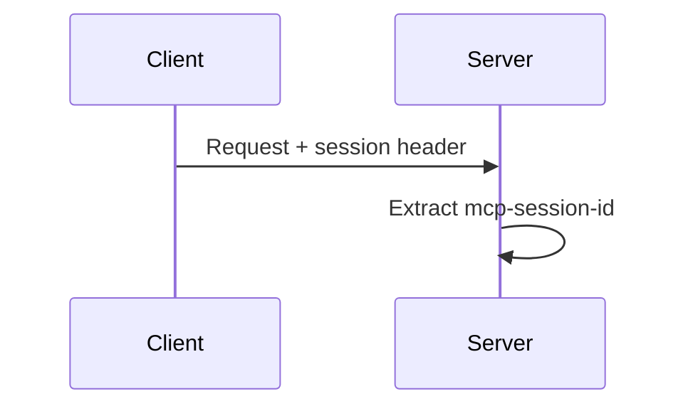

---

# **Slide 10 — Step 3: Lookup Session**

```ts
let transport = sid ? transports[sid] : undefined;
```

---

### Sequence Diagram

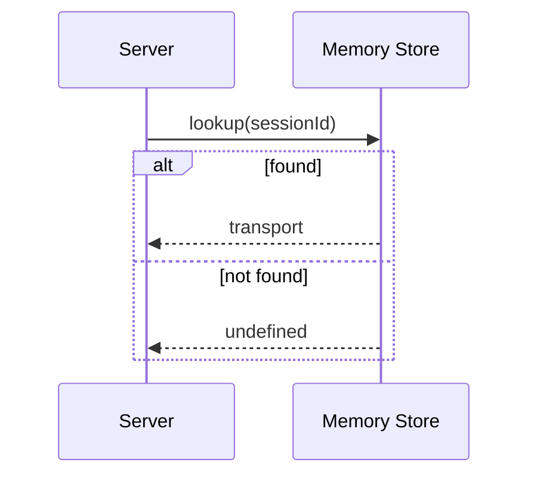

---

# **Slide 11 — Decision Point**

We decide:

* Reuse session
* OR create new session

---

### Flow Diagram

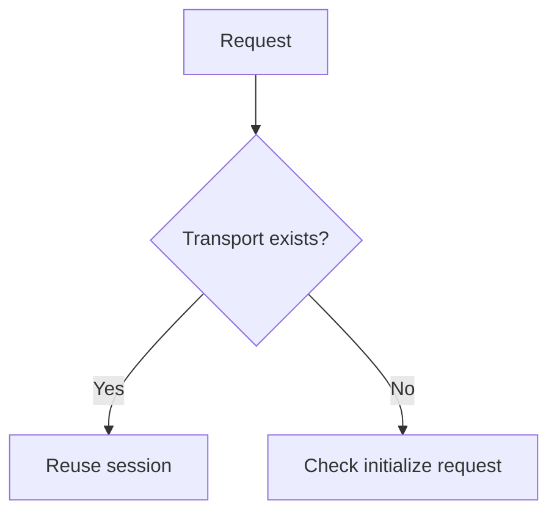

---

# **Slide 12 — Initialize Request**

Initialize means:

> Start a new MCP session

---

### Sequence Diagram

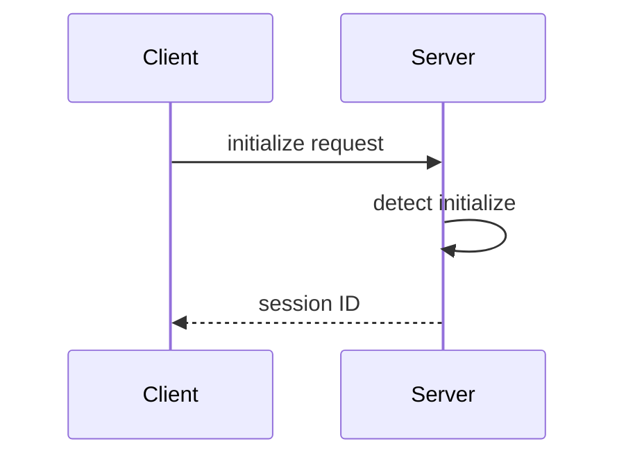

---

# **Slide 13 — Step 4: Create MCP Server**

```ts
const server = new McpServer({
  name: "example-stateful-server",
  version: "1.0.0",
});
```

---

### Sequence Diagram

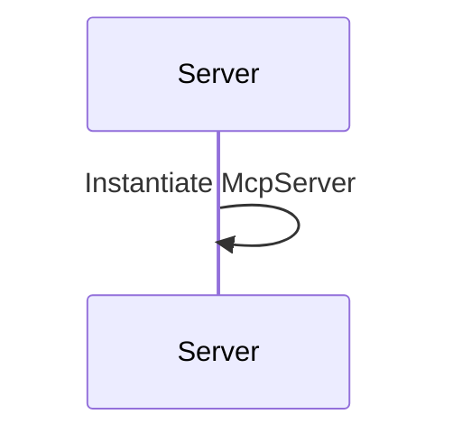

---

# **Slide 14 — Step 5: Create Transport**

```ts
transport = new StreamableHTTPServerTransport({
  sessionIdGenerator: () => randomUUID(),
});
```

---

### Sequence Diagram

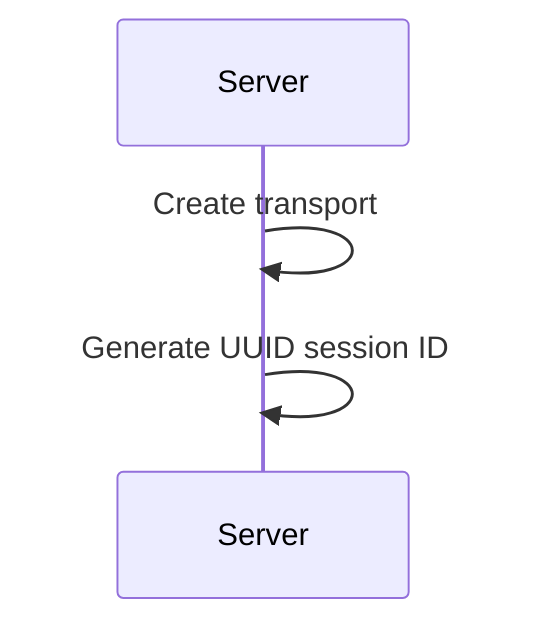

---

# **Slide 15 — Step 6: Store Session**

```ts
onsessioninitialized: (id) => {
  transports[id] = transport;
}
```

---

### Sequence Diagram

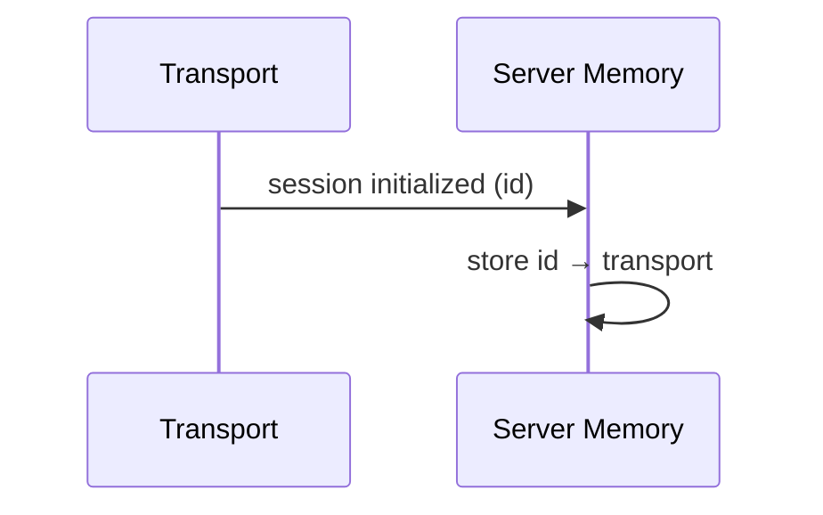

---

# **Slide 16 — Step 7: Connect Server**

```ts
await server.connect(transport);
```

---

### Sequence Diagram

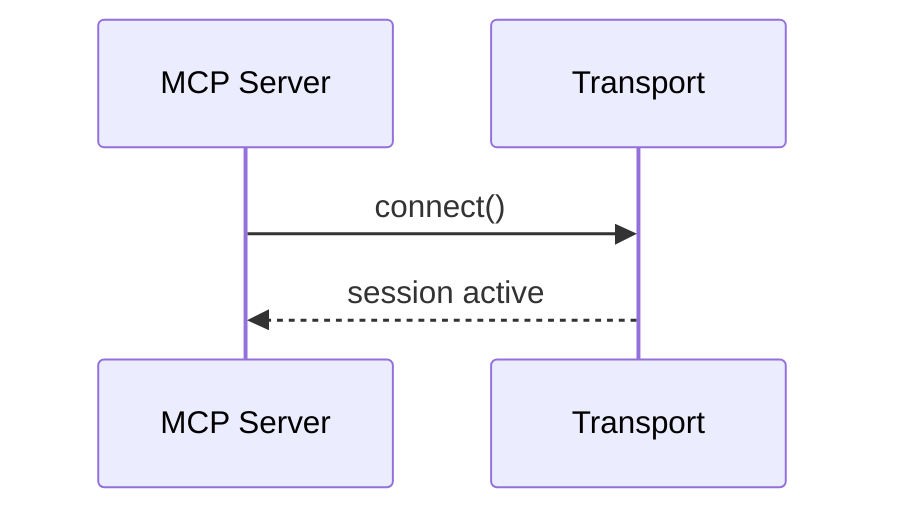

---

# **Slide 17 — Step 8: Handle Invalid Session**

```ts
if (!transport) {
  return res.status(400).json({ error: "invalid session" });
}
```

---

### Sequence Diagram

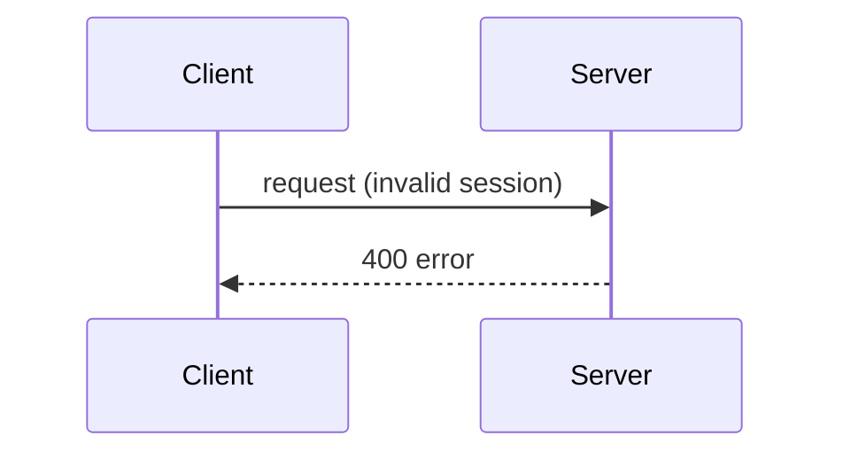

---

# **Slide 18 — Step 9: Process Request**

```ts
await transport.handleRequest(req, res, req.body);
```

---

### Sequence Diagram

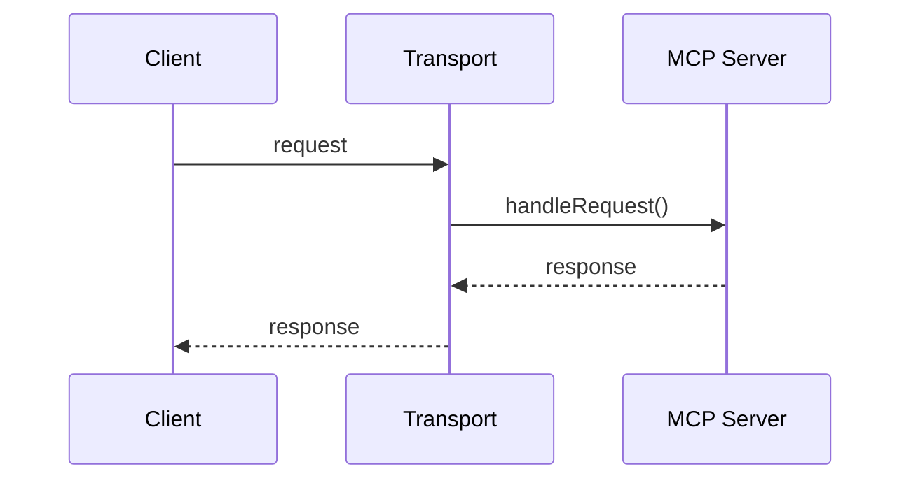

---

# **Slide 19 — Full Server Flow**

---

### Sequence Diagram

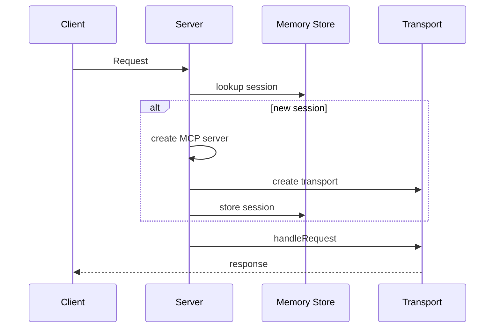

---

# **Slide 20 — Client: Session State**

```ts
let activeSessionId: string | null = null;
```

---

### Sequence Diagram

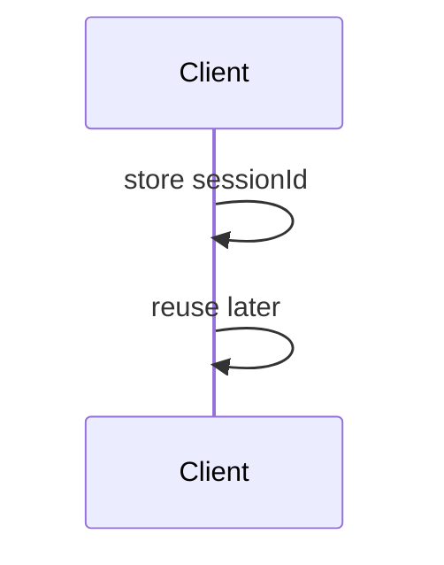

---

# **Slide 21 — Client Sends Session ID**

```ts
headers: () => ({
  "mcp-session-id": activeSessionId
})
```

---

### Sequence Diagram

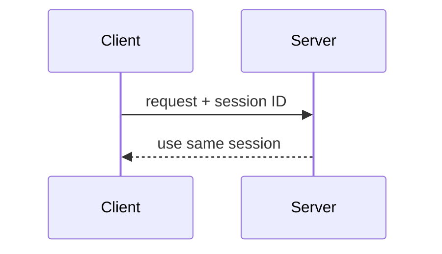

---

# **Slide 22 — Client Receives Session ID**

```ts
onSessionInitialized: (id) => {
  activeSessionId = id;
}
```

---

### Sequence Diagram

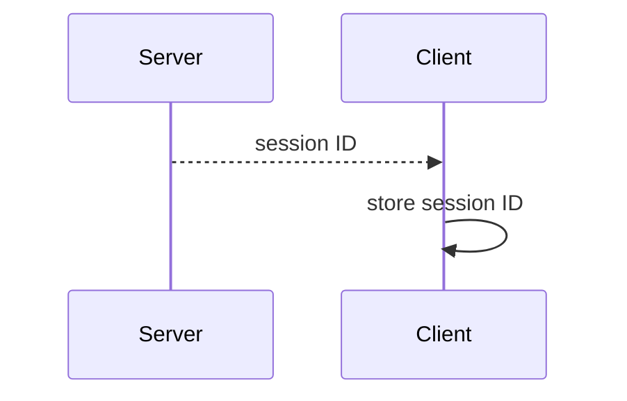

---

# **Slide 23 — Full Client Flow**

```ts
await client.connect(transport);
await client.ping();
await client.close();
```

---

### Sequence Diagram

```mermaid
sequenceDiagram
    participant C as Client
    participant S as Server

    C->>S: connect
    S-->>C: session ID

    C->>S: ping (session)
    S-->>C: response

    C->>S: close
```

---

# **Slide 24 — Stateless vs Stateful**

### Stateless

```mermaid
sequenceDiagram
    participant C as Client
    participant S as Server

    C->>S: Request A
    S-->>C: Response A

    C->>S: Request B (reset)
    S-->>C: Response B
```

### Stateful

```mermaid
sequenceDiagram
    participant C as Client
    participant S as Server

    C->>S: Request A (session)
    S-->>C: Response A

    C->>S: Request B (same session)
    S-->>C: Response B (context preserved)
```

---

# **Slide 25 — Why Stateful MCP Matters**

Your system now supports:

* Context retention
* Multi-step workflows
* Session tracking
* Production-grade AI tool execution

---

# **Slide 26 — Mental Model**

```mermaid
flowchart LR
    A[Client] --> B[Session ID]
    B --> C[Transport]
    C --> D[MCP Server]
    D --> C
```

---

# **Slide 27 — Final Takeaway**

You now built:

* Session-aware MCP architecture
* Persistent transport mapping
* Stateful request handling
* Full client-server session lifecycle

